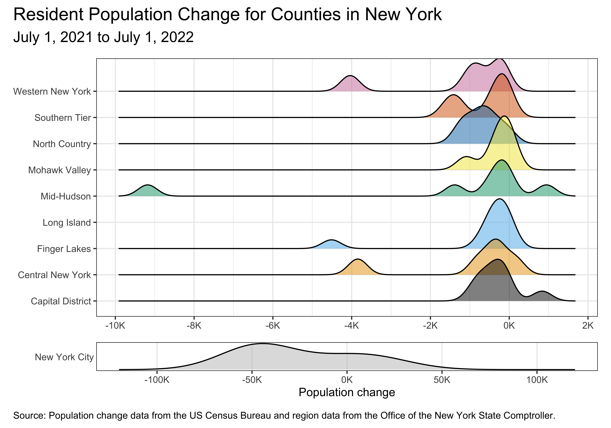

For any exercise where you’re writing code, insert a code cell and make sure to label the cell.
Use a short and informative label.
If using a package other than tidyverse, load it on the code cell labeled `load-packages` on top of your Quarto document.
For any exercise where you’re creating a plot, make sure to label all axes, legends, etc. and give it an informative title.
For any exercise where you’re including a description and/or interpretation, use full sentences.
Make a commit at least after finishing each exercise, or better yet, more frequently.
Push your work regularly to GitHub.
Once you’re done, inspect your GitHub repo to make sure you've pushed all of your changes.

::: callout-warning
Did you use an LLM / Generative AI tool to complete this assignment? If not, copy and paste the first option below at the end of **each question**.
Otherwise, copy and paste all statements that describe how you used it, again at the end of **each question**.
The purpose of the disclosure is for you to reflect on how you’re using AI in this course. 
It also helps learn whether and how students are effectively using AI.

- I didn't use an LLM / Generative AI tool for this question
- I asked it to clarify the question.
- I asked it clarifying questions to better understand a concept.
- I asked it to help write code to answer the question.
- I gave it my code and asked it to help me fix it.
- I asked it about an error or why code would do something I didn't want.
- I pasted the question prompt in AI and asked for help, but I wrote my answer myself.
- I pasted the question prompt in AI and copied and pasted at least some of the answer into my Quarto document.
- Other:______

If you selected any option(s) other than *No*, list your prompt(s) and include the name of the model you used and a link to the chat thread.

Additionally, make sure to cite any other non-AI sources you used to help you complete the question.
:::

In this assignment, you’ll work with data on population change from 2021 to 2022 in counties of New York state.

::: callout-caution
Each of the following questions ask you to reproduce a plot. You must use ggplot2 and start with the data provided. You may not use screenshots of the figures provided, in part or in full, as part of your solution.
:::

## Question 1

**New York state of counties.** Using the **tigris** package, download the shapefile for counties in the state of New York (NY) for year 2021. Cache the code chunk where this action is done so the shapefile isn’t downloaded each time you render. Then, in a separate code chunk, plot the county boundaries and label them. The word “County” should be omitted from the labels to keep them shorter, appropriate labels should be used, including a caption that mentions the data source, and the figure should be sized such that all labels are visible. It's ok if your labels are not placed in the exact same locations as the provided figure.

**Hint:** When downloading the shape file, set `progress_bar = FALSE` so that the progress bar isn’t printed in your rendered document.

{width=800px fig-align="center"}

## Question 2

**New York state of population change.** TL;DR: Reproduce the figure below. But you’re going to want to read more…

Next, fill in the color of the counties based on total population change from 2021 to 2022 using a *diverging* `RdBu` color palette. In order to do this, you will need to merge in the Excel file called `co-est2022-comp-36.xlsx` from your `data` folder to the shape file you loaded in the previous exercise. The Excel file is formatted such that there are merged cells on top that you don’t need as well as extraneous informational text at the bottom, so you will need to make use of additional arguments to the `read_excel()` package to skip some rows on top, limit the number of rows being read in, and label the columns appropriately. Label the column you will use for this analysis `total_pop_change_21_22`; note that this is variable name will then be reflected in the title of the legend in your figure. Do not label the counties so that we can see the map and the fill colors better, but do use appropriate labels should, including a caption that mentions the data sources, and use an appropriate aspect ratio and size for your figure.

**Hint:** There are 62 counties in New York State.

{width=800px fig-align="center"}

## Question 3

**New York state of regions.** TL;DR: Reproduce the figure below. But you’re going to want to read more…

New York State is divided into 10 regions along county boundaries. These regions are given in the CSV file called `ny_regions.csv` in your `data` folder. Merge in the region information to the data frame you have plotted in the previous exercise so that you have a new variable called `region` in your data frame. Then, create a new `sf` object that has the boundaries of the regions in its `sf_column` attribute, i.e., under `geometry`. Then, overlay this new `sf` object on the figure you created in the previous exercise, using a thicker line (`linewidth = 1`) to indicate region boundaries. It's ok if your labels are not placed in the exact same locations as the provided figure.

**Hints:**

-   Merging geographic areas is not something we’ve done in class previously, so you will need to figure out what tools to use to create these boundaries. It’s one of the `st_*()` functions from the [**sf**](https://r-spatial.github.io/sf/reference/index.html) package.
-   The `nudge_x` and `nudge_y` arguments to `geom_label_repel()` can be helpful to nudge the labels in a consistent manner away from the centers of the gegions.

{width=800px fig-align="center"}

## Question 4

**New York state of patchwork.** TL;DR: Reproduce the figure below. But you’re going to want to read more…

What we’re seeing is that what is happening in the New York City region is very different than the rest of New York State, which is probably not too surprising. So, let’s make it a bit easier to see each of the counties in New York City by insetting a zoomed-in version of that portion of the map. It's ok if your labels are not placed in the exact same locations as the provided figure.

**Hint:** The `inset_element()` function from the **patchwork** package will be helpful!

{width=800px fig-align="center"}

## Question 5

**New York state of ridges.** The goal of this exercise is to learn about a new type of plot (ridgeline plot), learn how to make it, and then evaluate its appropriateness for the data.

a. Recreate the following visualization. 

{fig-align="center" width="800"}

Some notes:

-   This figure uses a colorblind-friendly color scale from ggthemes.

-   The theme is `theme_bw()`.

::: callout-tip
This is not a geom we introduced in class, so seeing an example of it in action will be helpful. Read the package README at <https://wilkelab.org/ggridges> and/or the introduction vignette at <https://wilkelab.org/ggridges/articles/introduction.html>. There is more information than you need for this question in the vignette; the first section on Geoms should be sufficient to help you get started.
:::

b. What (if any) question(s) can be answered with this visualization? 

c. Do you have any concerns about using this geom for these data? If no, state why. If yes, state your concern(s) and reason(s) for your concern(s).

