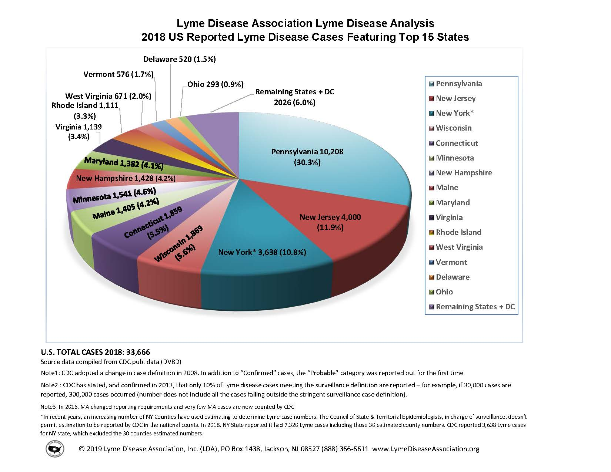

For any exercise that involves writing code, insert a code cell and label it.
Use a short and informative label.
If using a package other than tidyverse, load it in the code cell labeled `load-packages` on top of your Quarto document.
For any exercise where you’re creating a plot, make sure to label all axes, legends, etc., and give it an informative title.
For any exercise where you’re including a description and/or interpretation, use full sentences.
Make a commit at least after finishing each exercise, or better yet, more frequently.
Push your work regularly to GitHub.
Once you’re done, inspect your GitHub repo to make sure you've pushed all of your changes.

::: callout-warning
Did you use an LLM / Generative AI tool to complete this assignment? If not, copy and paste the first option below at the end of **each question**.
Otherwise, copy and paste all statements that describe how you used it, again at the end of **each question**.
The purpose of the disclosure is for you to reflect on how you’re using AI in this course. 
It also helps learn whether and how students are effectively using AI.

- I didn't use an LLM / Generative AI tool for this question
- I asked it to clarify the question.
- I asked clarifying questions to better understand a concept.
- I asked it to help write code to answer the question.
- I gave it my code and asked it to help me fix it.
- I asked it about an error or why the code would do something I didn't want.
- I pasted the question prompt in AI and asked for help, but I wrote my answer myself.
- I pasted the question prompt in AI and copied and pasted at least some of the answer into my Quarto document.
- Other:______

If you selected any option(s) other than *No*, list your prompt(s) and include the name of the model you used and a link to the chat thread.

Additionally, make sure to cite any other non-AI sources you used to help you complete the question.
:::

::: callout-important
This assignment is optional!
:::

## Question 1

**Country populations.** For this exercise, you will work with data on country populations.
The data come from [The World Bank](https://data.worldbank.org/indicator/SP.POP.TOTL).
The dataset you will use is in your `data/` folder, and it’s called `country-pop.csv`.

-   Load the two datasets using `read_csv()`.

    -   You will need to use the `skip` argument since the CSV file has some extraneous rows on top. First, load the data without it, then determine how many rows to skip.
    -   Make sure there are no extraneous columns by removing them.
    -   Use `janitor::clean_names()`

-   Find the countries with the top 10 highest population counts in 2020.
    Subset the data for just these 10 countries.

-   Create a racing bar chart, using **gganimate** for the change in population for these countries.

## Question 2

**Adopt, don’t shop.** The data for this exercise comes from [The Pudding](https://github.com/the-pudding/data/blob/master/dog-shelters/README.md) via [TidyTuesday](https://github.com/rfordatascience/tidytuesday/tree/master/data/2019/2019-12-17).

a.  Load the `dog-travel` dataset included in the `data` folder of your repository with `read_csv()`.

b.  Calculate the number of dogs available to adopt per `contact_state`.
    Save the result as a new data frame with variables `contact_state` and `n`.

c.  Make a histogram of the number of dogs available to adopt and describe the distribution of this variable.

d.  Use this dataset to make a map of the US states, where each state is filled in with a color based on the number of dogs available to adopt in that state.

    ::: callout-tip
    -   Use the `state.abb` and `state.name` objects in R as a lookup table to match state names to abbreviations.
    -   Use a gradient color scale and `log10` transformation.
    :::

e.  Interpret the visualization.

## Question 3

**Key lyme pie.** The goal of this exercise is to recreate a pie chart in R and then improve it by presenting the same information as a bar graph.
The pie chart to be recreated is below, and it comes from the Lyme Disease Association ([which has closed its doors as of 2024](https://lymediseaseassociation.org/)).

Below are the steps I recommend you follow and some guidance on what (not) to worry about:

-   First, create the data frame: Use the annotations in the visualization provided to do this.
    You should create the new data frame using the `tibble()` or the `tribble()` functions.

-   Then, recreate the pie chart: When recreating the pie chart, you do not need to

    -   make it a 3D pie chart (2D is sufficient)
    -   match the colors (default ggplot2 colors or any other color palette is fine)
    -   annotate the plot in the same way (just the legend is sufficient)
    -   match the entire caption (see below for what we want you to match)

    However, you should,

    -   make a 2D pie chart
    -   present a legend on the right that shows the mapping of the colors to states
    -   match the title text, location, and alignment
    -   match the text, location, and alignment of the first two lines of the caption

-   Finally, improve the visualization by presenting this information in the form of a bar graph.
    And as an additional challenge, imagine you’re working for the state of Maine, so highlight that bar corresponding to that state in some way.
    Write a sentence or two describing why you chose to highlight the Maine info the way you did.

## Question 4

**Revisit and tabulate.** Take a dataset you visualized in an earlier HW assignment and construct a table communicating the same or relevant message using the **gt** package and following the "10 Guidelines for Better Tables" as much as possible.

::: callout-note
-   Place the relevant data in the `data` folder.
-   Not all of the guidelines will be relevant, and I’m not looking for the perfect table. Instead, I would like you to make three decisions based on what you learned about good tables, explain why you made them, and implement them. You’re welcome to make more than three improvements to the default table, but you’re not expected to do so (for grading purposes).
:::

## Question 5

**Generate.** Create a piece of generative art using either the [**jasmines**](https://jasmines.djnavarro.net/) package, a different R package designed for the same purpose, or a system you build from scratch.
Provide at least three bullet points for some of the choices you make in building this piece, either functions you use or their parameters.
