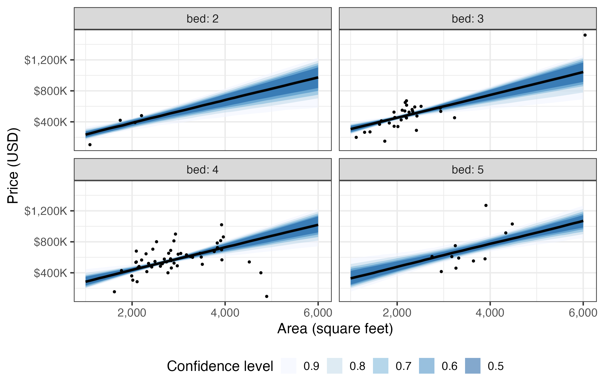
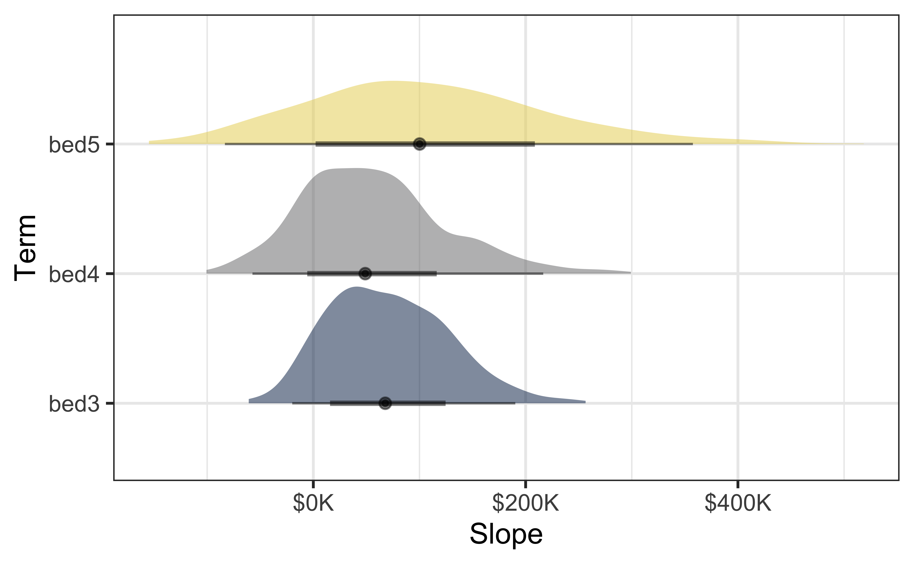
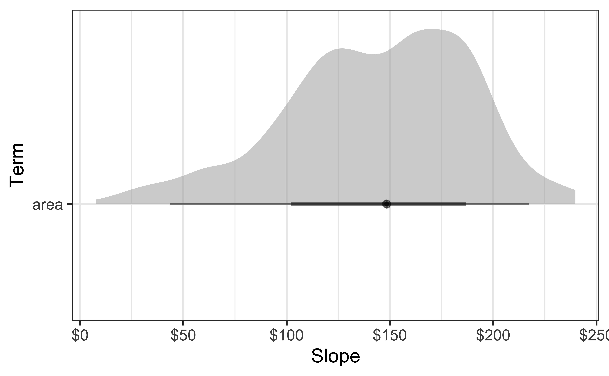
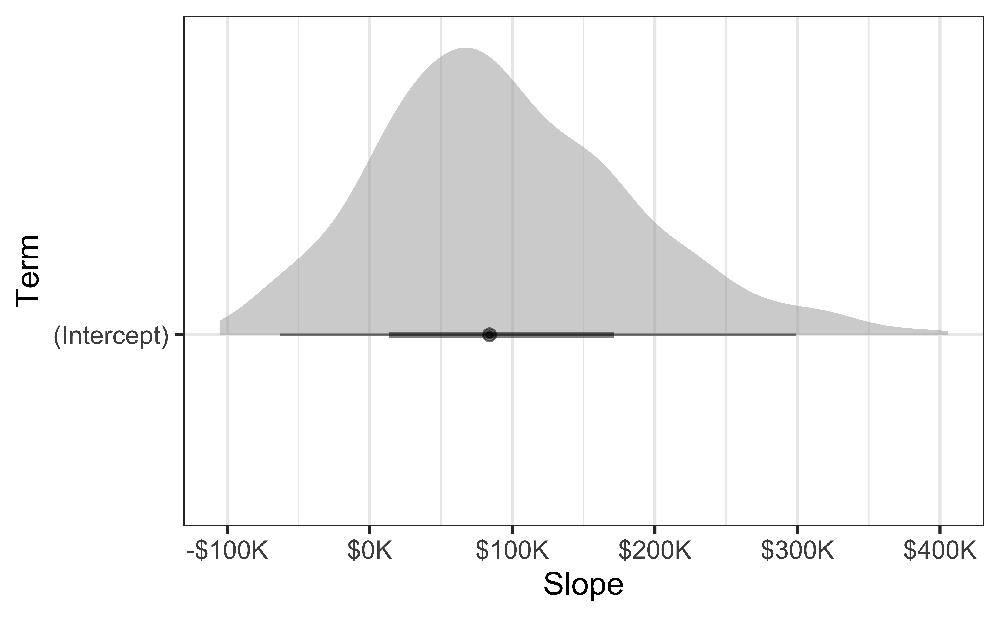
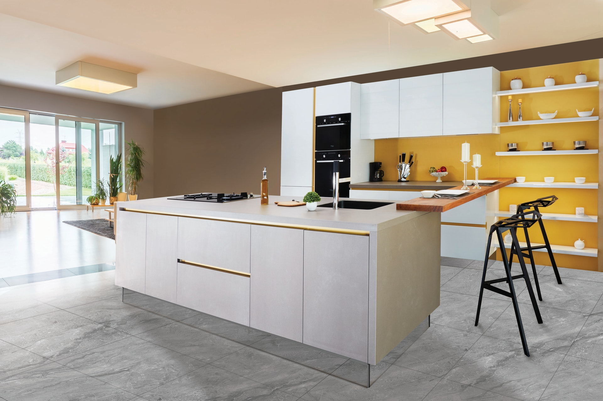

# Warm up

## Announcements

- **HW 3** due on Thursday at 5 pm

- (Optional, but hugely appreciated) Anonymous **midterm course feedback survey** due Sunday at 11:59 pm, available on Canvas

## Setup {.smaller}

```{r}
#| label: setup
#| message: false
# load packages
library(tidyverse)
library(tidymodels)
library(ggdist)
library(ggthemes)
library(openintro)
library(scales)
library(colorspace)
library(ggrepel)

# set theme for ggplot2
ggplot2::theme_set(ggplot2::theme_minimal(base_size = 16))

# set figure parameters for knitr
knitr::opts_chunk$set(
  fig.width = 7, # 7" width
  fig.asp = 0.618, # the golden ratio
  fig.retina = 3, # dpi multiplier for displaying HTML output on retina
  fig.align = "center", # center align figures
  dpi = 300 # higher dpi, sharper image
)
```

# From last time

# Visualizing uncertainty of model estimates

## Data: House prices in Duke Forest {.smaller}

```{r}
openintro::duke_forest
```

## Data prep

-   Remove 6 bedroom houeses
-   Make `bed` a factor variable

```{r}
duke_forest <- duke_forest |>
  filter(bed != 6) |>
  mutate(bed = as.factor(bed))
```

## Bootstrap

```{r}
n_rep <- 500

set.seed(25)

duke_forest_bootstraps <- map_dfr(
  seq_len(n_rep),
  function(i) {
    duke_forest |>
      slice_sample(prop = 1, by = bed, replace = TRUE) |>
      mutate(resample = i, .before = address)
  }
)
```

## Bootstrap samples {.smaller}

```{r}
duke_forest_bootstraps
```

## `ae-09`: Part 1 {.smaller}

::: task
The following visualization shows **bootstrap confidence intervals for predictions** from additive (main effects) models for predicting price from area and number of bedrooms.
Recreate the visualization.
Once you're done, share your code and plot on Slack in #general.
:::

{fig-align="center" width="1000"}

## `ae-09`: Part 2 {.smaller}

::: task
Construct and visualize **bootstrap distributions of model estimates** using halfeye plots, i.e., recreate the following visualization.
Once you're done, share your code and plot on Slack in #general.
Then, try other `stat`s (other ways of visualizing the distributions) from the **ggdist** package.
:::

::: {layout-ncol="3"}





:::

# Color scales

## Uses of color in data visualization

::: columns
::: {.column width="40%"}
1.  Distinguish categories (qualitative)
:::

::: {.column width="60%"}

:::
:::

## Qualitative scale: Okabe-Ito palette

```{r}
#| label: popgrowth-vs-popsize-okabeito
#| message: false
#| fig.width: 8
#| fig.asp: 0.55
#| echo: false
US_census <- read_csv(here::here("slides/14", "data", "apportionment.csv")) |>
  janitor::clean_names() |>
  select(name, geography_type, year, resident_population) |>
  filter(
    geography_type == "State",
    year %in% c(2010, 2020),
    name != "Puerto Rico"
  ) |>
  rename(state = name)
US_regions <- read_csv(here::here("slides/14", "data", "US_regions.csv"))

popgrowth <- US_census |>
  left_join(US_regions, by = join_by(state)) |>
  pivot_wider(
    names_from = year,
    values_from = resident_population,
    names_prefix = "pop"
  ) |>
  group_by(region, division, state) |>
  summarize(
    pop2010 = sum(pop2010, na.rm = TRUE),
    pop2020 = sum(pop2020, na.rm = TRUE),
    popgrowth = (pop2020 - pop2010) / pop2010,
    .groups = "drop"
  ) |>
  mutate(
    region = fct_relevel(region, "West", "South", "Midwest", "Northeast")
  )

region_colors <- c("#E69F00", "#56B4E9", "#009E73", "#F0E442")

labeled_states <- popgrowth |>
  arrange(region, popgrowth) |>
  group_by(region) |>
  slice(1, n()) |>
  pull(state)

df_repel <- select(popgrowth, x = pop2010, y = popgrowth, state) |>
  mutate(label = ifelse(state %in% labeled_states, as.character(state), ""))

p <- ggplot(
  popgrowth,
  aes(x = pop2010, y = popgrowth, color = region, fill = region)
) +
  geom_point(size = 3, shape = "circle filled") +
  geom_text_repel(
    data = df_repel,
    aes(x, y, label = label),
    segment.alpha = 0.5,
    point.padding = 0.25,
    box.padding = .8,
    force = 1,
    min.segment.length = 0.1,
    max.overlaps = 1000,
    size = 10 / .pt,
    seed = 7586,
    inherit.aes = FALSE
  ) +
  scale_x_log10(
    breaks = c(1e6, 3e6, 1e7, 3e7),
    labels = expression(10^6, 3 %*% 10^6, 10^7, 3 %*% 10^7)
  ) +
  scale_y_continuous(
    labels = label_percent(accuracy = 1),
    minor_breaks = NULL
  ) +
  labs(
    x = "Population size in 2010",
    y = "Population growth, 2010 to 2020",
    color = "Region",
    fill = "Region"
  )

p +
  scale_fill_manual(values = region_colors) +
  scale_color_manual(values = darken(region_colors, 0.3))
```

## Qualitative scale: ColorBrewer Set1

```{r}
#| label: popgrowth-vs-popsize-colorbrewerset1
#| message: false
#| fig.width: 8
#| fig.asp: 0.55
#| echo: false
region_colors <- RColorBrewer::brewer.pal(4, "Set1")

p +
  scale_fill_manual(values = region_colors) +
  scale_color_manual(values = darken(region_colors, 0.3))
```

## Qualitative scale: ColorBrewer Set3

```{r}
#| label: popgrowth-vs-popsize-colorbrewerset3
#| message: false
#| fig.width: 8
#| fig.asp: 0.55
#| echo: false
region_colors <- RColorBrewer::brewer.pal(4, "Set3")

p +
  scale_fill_manual(values = region_colors) +
  scale_color_manual(values = darken(region_colors, 0.3))
```

## Uses of color in data visualization

::: columns
::: {.column width="40%"}
1.  Distinguish categories (qualitative)
2.  Represent numeric values (sequential)
:::

::: {.column width="60%"}
 
:::
:::

## Sequential scale: Viridis palette

```{r}
#| label: four-locations-temps-by-month-viridis
#| message: false
#| fig.width: 9
#| fig.asp: 0.3
#| echo: false
temperatures_chicago <- read_csv(here::here("slides/14", "data/chicago.csv")) |>
  janitor::clean_names() |>
  filter(!is.na(tavg)) |>
  mutate(date = mdy(date)) |>
  group_by(date) |>
  summarize(daily_temp = mean(tavg), .groups = "drop") |>
  mutate(name = "Chicago", .before = date)

temperatures_other_cities <- read_csv(here::here(
  "slides/14",
  "data/temperatures.csv"
)) |>
  janitor::clean_names() |>
  filter(!is.na(tavg)) |>
  mutate(
    date = mdy(date),
    name = case_when(
      str_detect(name, "TX") ~ "Houston",
      str_detect(name, "CA") ~ "Los Angeles",
      str_detect(name, "NC") ~ "Relaigh-Durham",
      .default = name
    )
  ) |>
  group_by(name, date) |>
  summarize(daily_temp = mean(tavg), .groups = "drop")

temperatures <- bind_rows(temperatures_chicago, temperatures_other_cities)

temperatures_months <- temperatures |>
  mutate(month_name = month(date, label = TRUE, abbr = TRUE)) |>
  group_by(name, month_name) |>
  summarize(mean_month_temp = mean(daily_temp), .groups = "drop") |>
  mutate(
    name = fct_relevel(
      name,
      "Chicago",
      "Los Angeles",
      "Relaigh-Durham",
      "Houston"
    )
  )

p <- ggplot(
  temperatures_months,
  aes(x = month_name, y = name, fill = mean_month_temp)
) +
  geom_tile(width = 0.95, height = 0.95) +
  coord_fixed(expand = FALSE) +
  theme_minimal() +
  labs(
    x = NULL,
    y = NULL,
    fill = "Temperature (°F)"
  ) +
  theme(legend.position = "bottom")

p +
  scale_fill_viridis_c(
    option = "D",
  )
```

## Sequential scale: Inferno palette


```{r}
#| label: four-locations-temps-by-month-inferno
#| message: false
#| fig.width: 9
#| fig.asp: 0.3
#| echo: false
p +
  scale_fill_viridis_c(
    option = "B",
    begin = 0.15,
    end = 0.98,
  )
```

## Sequential scale: Cividis palette

```{r}
#| label: four-locations-temps-by-month-cividis
#| message: false
#| fig.width: 9
#| fig.asp: 0.3
#| echo: false
p +
  scale_fill_viridis_c(
    option = "E"
  )
```

## Uses of color in data visualization

::: columns
::: {.column width="40%"}
1.  Distinguish categories (qualitative)
2.  Represent numeric values (sequential)
3.  Represent numeric values (diverging)
:::

::: {.column width="60%"}
  
:::
:::

## Diverging scale: ColorBrewer PiYG palette

```{r}
#| label: forensic-correlations-colorbrewerpiyg
#| message: false
#| fig-asp: 0.5
#| echo: false
forensic_glass <- read_csv("data/forensic_glass.csv")

cm <- cor(select(forensic_glass, -type, -RI, -Si))
df_wide <- as.data.frame(cm)
df_long <- stack(df_wide)
names(df_long) <- c("cor", "var1")
df_long <- cbind(df_long, var2 = rep(rownames(cm), length(rownames(cm))))
clust <- hclust(as.dist(1 - cm), method = "average")
levels <- clust$labels[clust$order]
df_long$var1 <- factor(df_long$var1, levels = levels)
df_long$var2 <- factor(df_long$var2, levels = levels)

p <- ggplot(
  filter(df_long, as.integer(var1) < as.integer(var2)),
  aes(var1, var2, fill = cor)
) +
  geom_tile(color = "white", linewidth = 1) +
  scale_x_discrete(position = "top", name = NULL, expand = c(0, 0)) +
  scale_y_discrete(name = NULL, expand = c(0, 0)) +
  guides(
    fill = guide_colorbar(
      direction = "horizontal",
      label.position = "bottom",
      title.position = "top",
      barwidth = grid::unit(140, "pt"),
      barheight = grid::unit(17.5, "pt"),
      ticks.linewidth = 1
    )
  ) +
  coord_fixed() +
  theme(
    axis.line = element_blank(),
    axis.ticks = element_blank(),
    panel.grid = element_blank(),
    legend.position = "inside",
    legend.position.inside = c(0.75, 0.15),
    legend.title.align = 0.5
  )

p +
  scale_fill_distiller(
    name = "correlation",
    limits = c(-.5, .5),
    breaks = c(-.5, 0, .5),
    labels = c("–0.5", "0.0", "0.5"),
    type = "div",
    palette = "PiYG",
    direction = 1
  )
```

::: aside
Figure redrawn from [Claus O. Wilke. Fundamentals of Data Visualization. O'Reilly, 2019.](https://clauswilke.com/dataviz)
:::

## Diverging scale: ColorBrewer Carto Earth palette

```{r}
#| label: forensic-correlations-cartoearth
#| message: false
#| fig-asp: 0.5
#| echo: false
p +
  scale_fill_continuous_divergingx(
    name = "correlation",
    limits = c(-.5, .5),
    breaks = c(-.5, 0, .5),
    labels = c("–0.5", "0.0", "0.5"),
    palette = "Earth",
    rev = FALSE
  )
```

::: aside
Figure redrawn from [Claus O. Wilke. Fundamentals of Data Visualization. O'Reilly, 2019.](https://clauswilke.com/dataviz)
:::

## Diverging scale: Blue-Red palette

```{r}
#| label: forensic-correlations-bluered
#| message: false
#| fig-asp: 0.5
#| echo: false
p +
  scale_fill_continuous_diverging(
    name = "correlation",
    limits = c(-.5, .5),
    breaks = c(-.5, 0, .5),
    labels = c("–0.5", "0.0", "0.5"),
    palette = "Blue-Red",
    rev = TRUE
  )
```

::: aside
Figure redrawn from [Claus O. Wilke. Fundamentals of Data Visualization. O'Reilly, 2019.](https://clauswilke.com/dataviz)
:::

## Uses of color in data visualization

::: columns
::: {.column width="40%"}
1.  Distinguish categories (qualitative)
2.  Represent numeric values (sequential)
3.  Represent numeric values (diverging)
4.  Highlight
:::

::: {.column width="60%"}
   
:::
:::

## Highlighting: Grays with accents

```{r}
#| label: Aus-athletes-track-grayred
#| message: false
#| fig.width: 8
#| fig.asp: 0.55
#| echo: false
male_Aus <- ggridges::Aus_athletes |>
  filter(sex == "m") |>
  filter(
    sport %in%
      c(
        "basketball",
        "field",
        "swimming",
        "track (400m)",
        "track (sprint)",
        "water polo"
      )
  ) |>
  mutate(
    sport = case_when(
      sport == "track (400m)" ~ "track",
      sport == "track (sprint)" ~ "track",
      TRUE ~ sport
    ),
    sport = factor(
      sport,
      levels = c("track", "field", "water polo", "basketball", "swimming")
    )
  )

p <- ggplot(
  male_Aus,
  aes(x = height, y = pcBfat, shape = sport, color = sport, fill = sport)
) +
  geom_point(size = 3) +
  scale_shape_manual(values = 21:25) +
  labs(
    x = "height (cm)",
    y = "% body fat"
  )

colors <- c("#BD3828", rep("#808080", 4))
fills <- c(
  alpha(colors[1], .815),
  alpha(colors[2:5], .5)
)

p +
  scale_color_manual(values = colors) +
  scale_fill_manual(values = fills)
```

::: aside
Figure redrawn from [Claus O. Wilke. Fundamentals of Data Visualization. O'Reilly, 2019.](https://clauswilke.com/dataviz)
:::

## Highlighting: Okabe-Ito accent

```{r}
#| label: Aus-athletes-track-okabeito
#| message: false
#| fig.width: 8
#| fig.asp: 0.55
#| echo: false
accent_OkabeIto <- c(
  "#E69F00",
  "#56B4E9",
  "#CC79A7",
  "#F0E442",
  "#0072B2",
  "#009E73",
  "#D55E00"
)
accent_OkabeIto[1:4] <- desaturate(lighten(accent_OkabeIto[1:4], .4), .8)
accent_OkabeIto[5:7] <- darken(accent_OkabeIto[5:7], .3)

colors <- c(accent_OkabeIto[5], darken(accent_OkabeIto[1:4], .2))
fills <- c(
  alpha(accent_OkabeIto[5], .7),
  alpha(accent_OkabeIto[1:4], .7)
)

p +
  scale_color_manual(values = colors) +
  scale_fill_manual(values = fills)
```

::: aside
Figure redrawn from [Claus O. Wilke. Fundamentals of Data Visualization. O'Reilly, 2019.](https://clauswilke.com/dataviz)
:::

## Highlighting: ColorBrewer accent

```{r}
#| label: Aus-athletes-track-colorbrewer
#| message: false
#| fig.width: 8
#| fig.asp: 0.55
#| echo: false
accent_Brewer <- RColorBrewer::brewer.pal(7, name = "Accent")[c(7, 1:4)]

colors <- darken(accent_Brewer, .2)
fills <- c(accent_Brewer[1], alpha(accent_Brewer[2:5], .7))

p +
  scale_color_manual(values = colors) +
  scale_fill_manual(values = fills)
```

::: aside
Figure redrawn from [Claus O. Wilke. Fundamentals of Data Visualization. O'Reilly, 2019.](https://clauswilke.com/dataviz)
:::

## Uses of color in data visualization

::: columns
::: {.column width="40%"}
1.  Distinguish categories (qualitative)
2.  Represent numeric values (sequential)
3.  Represent numeric values (diverging)
4.  Highlight
:::

::: {.column width="60%"}
   
:::
:::

# Color scales in **ggplot2**

## **ggplot2** color scale functions {.smaller}

| Scale function      | Aesthetic | Data type | Palette type |
|:--------------------|:----------|:----------|:-------------|
| `scale_color_hue()` | `color`   | discrete  | qualitative  |

## **ggplot2** color scale functions {.smaller}

| Scale function      | Aesthetic | Data type | Palette type |
|:--------------------|:----------|:----------|:-------------|
| `scale_color_hue()` | `color`   | discrete  | qualitative  |
| `scale_fill_hue()`  | `fill`    | discrete  | qualitative  |

## **ggplot2** color scale functions {.smaller}

| Scale function           | Aesthetic | Data type  | Palette type |
|:-------------------------|:----------|:-----------|:-------------|
| `scale_color_hue()`      | `color`   | discrete   | qualitative  |
| `scale_fill_hue()`       | `fill`    | discrete   | qualitative  |
| `scale_color_gradient()` | `color`   | continuous | sequential   |

## **ggplot2** color scale functions {.smaller}

| Scale function            | Aesthetic | Data type  | Palette type |
|:--------------------------|:----------|:-----------|:-------------|
| `scale_color_hue()`       | `color`   | discrete   | qualitative  |
| `scale_fill_hue()`        | `fill`    | discrete   | qualitative  |
| `scale_color_gradient()`  | `color`   | continuous | sequential   |
| `scale_color_gradient2()` | `color`   | continuous | diverging    |

## **ggplot2** color scale functions {.smaller}

| Scale function            | Aesthetic | Data type  | Palette type                       |
|:-----------------|:-----------------|:------------------|:------------------|
| `scale_color_hue()`       | `color`   | discrete   | qualitative                        |
| `scale_fill_hue()`        | `fill`    | discrete   | qualitative                        |
| `scale_color_gradient()`  | `color`   | continuous | sequential                         |
| `scale_color_gradient2()` | `color`   | continuous | diverging                          |
| `scale_fill_viridis_c()`  | `color`   | continuous | sequential                         |
| `scale_fill_viridis_d()`  | `fill`    | discrete   | sequential                         |
| `scale_color_brewer()`    | `color`   | discrete   | qualitative, diverging, sequential |
| `scale_fill_brewer()`     | `fill`    | discrete   | qualitative, diverging, sequential |
| `scale_color_distiller()` | `color`   | continuous | qualitative, diverging, sequential |

...

and there are many many more

## Examples {.smaller}

No fill scale defined, default is `scale_fill_gradient()`:

```{r}
#| label: temps-tiles1
#| output-location: column-fragment
ggplot(
  temperatures_months,
  aes(
    x = month_name,
    y = name,
    fill = mean_month_temp
  )
) +
  geom_tile(
    width = 0.95,
    height = 0.95
  ) +
  coord_fixed(expand = FALSE) +
  theme(
    legend.position = "bottom"
  )
```

## Examples {.smaller}

```{r}
#| label: temps-tiles2
#| output-location: column-fragment
ggplot(
  temperatures_months,
  aes(
    x = month_name,
    y = name,
    fill = mean_month_temp
  )
) +
  geom_tile(
    width = 0.95,
    height = 0.95
  ) +
  scale_fill_gradient() +
  coord_fixed(expand = FALSE) +
  theme(
    legend.position = "bottom"
  )
```

## Examples {.smaller}

```{r}
#| label: temps-tiles3
#| output-location: column-fragment
ggplot(
  temperatures_months,
  aes(
    x = month_name,
    y = name,
    fill = mean_month_temp
  )
) +
  geom_tile(
    width = 0.95,
    height = 0.95
  ) +
  scale_fill_viridis_c() +
  coord_fixed(expand = FALSE) +
  theme(
    legend.position = "bottom"
  )
```

## Examples {.smaller}

```{r}
#| label: temps-tiles4
#| output-location: column-fragment
ggplot(
  temperatures_months,
  aes(
    x = month_name,
    y = name,
    fill = mean_month_temp
  )
) +
  geom_tile(
    width = 0.95,
    height = 0.95
  ) +
  scale_fill_viridis_c(
    option = "B",
    begin = 0.15
  ) +
  coord_fixed(expand = FALSE) +
  theme(
    legend.position = "bottom"
  )
```

## Examples {.smaller}

```{r}
#| label: temps-tiles5
#| output-location: column-fragment
ggplot(
  temperatures_months,
  aes(
    x = month_name,
    y = name,
    fill = mean_month_temp
  )
) +
  geom_tile(
    width = 0.95,
    height = 0.95
  ) +
  scale_fill_distiller(
    palette = "YlGnBu"
  ) +
  coord_fixed(expand = FALSE) +
  theme(
    legend.position = "bottom"
  )
```

# Color scales in the **colorspace** package

## The **colorspace** package creates some order {.smaller}

Scale name: `scale_<aesthetic>_<datatype>_<colorscale>()`

-   `<aesthetic>`: name of the aesthetic (`fill`, `color`, `colour`)
-   `<datatype>`: type of variable plotted (`discrete`, `continuous`, `binned`)
-   `<colorscale>`: type of the color scale (`qualitative`, `sequential`, `diverging`, `divergingx`)

. . .

| Scale function                        | Aesthetic | Data type  | Palette type |
|:------------------|:----------------|:----------------|:-------------------|
| `scale_color_discrete_qualitative()`  | `color`   | discrete   | qualitative  |
| `scale_fill_continuous_sequential()`  | `fill`    | continuous | sequential   |
| `scale_colour_continous_divergingx()` | `colour`  | continuous | diverging    |

## Examples {.smaller}

```{r}
#| label: temps-tiles6
#| output-location: column-fragment
ggplot(
  temperatures_months,
  aes(x = month_name, y = name, fill = mean_month_temp)
) +
  geom_tile(
    width = 0.95,
    height = 0.95
  ) +
  coord_fixed(
    expand = FALSE
  ) +
  scale_fill_continuous_sequential(
    palette = "YlGnBu",
    rev = FALSE
  ) +
  theme(
    legend.position = "bottom"
  )
```

## Examples

```{r}
#| label: temps-tiles7
#| output-location: column-fragment
ggplot(
  temperatures_months,
  aes(x = month_name, y = name, fill = mean_month_temp)
) +
  geom_tile(
    width = 0.95,
    height = 0.95
  ) +
  coord_fixed(
    expand = FALSE
  ) +
  scale_fill_continuous_sequential(
    palette = "Viridis",
    rev = FALSE
  ) +
  theme(
    legend.position = "bottom"
  )
```

## Examples

```{r}
#| label: temps-tiles8
#| output-location: column-fragment
ggplot(
  temperatures_months,
  aes(x = month_name, y = name, fill = mean_month_temp)
) +
  geom_tile(
    width = 0.95,
    height = 0.95
  ) +
  coord_fixed(
    expand = FALSE
  ) +
  scale_fill_continuous_sequential(
    palette = "Inferno",
    begin = 0.15,
    rev = FALSE
  ) +
  theme(
    legend.position = "bottom"
  )
```

## HCL (Hue-Chroma-Luminance) palettes: Sequential {.smaller}

```{r}
#| label: colorspace-palettes-seq
#| output-location: fragment
colorspace::hcl_palettes(type = "sequential", plot = TRUE)
```

## HCL palettes: Diverging

```{r}
#| label: colorspace-palettes-div
#| output-location: fragment
colorspace::hcl_palettes(type = "diverging", plot = TRUE, n = 9)
```

## HCL palettes: Divergingx

```{r}
#| label: colorspace-palettes-divx
#| output-location: fragment
colorspace::divergingx_palettes(plot = TRUE, n = 9)
```

# Setting colors manually

## Discrete

No color scale defined, default is `scale_color_hue()`:

```{r}
#| label: qual-scales-example1
#| output-location: column-fragment
ggplot(
  popgrowth,
  aes(
    x = pop2010,
    y = popgrowth,
    color = region
  )
) +
  geom_point() +
  scale_x_log10()
```

## Discrete {.smaller}

`scale_color_hue()`:

```{r}
#| label: qual-scales-example2
#| output-location: column-fragment
ggplot(
  popgrowth,
  aes(
    x = pop2010,
    y = popgrowth,
    color = region
  )
) +
  geom_point() +
  scale_x_log10() +
  scale_color_hue()
```

## Discrete {.smaller}

`scale_color_colorblind()`, uses Okabe-Ito colors:

```{r}
#| label: qual-scales-example3
#| output-location: column-fragment
ggplot(
  popgrowth,
  aes(
    x = pop2010,
    y = popgrowth,
    color = region
  )
) +
  geom_point() +
  scale_x_log10() +
  scale_color_colorblind()
```

## Discrete {.smaller}

Qualitative scales are best set manually:

```{r}
#| label: qual-scales-example4
#| output-location: column-fragment
ggplot(
  popgrowth,
  aes(
    x = pop2010,
    y = popgrowth,
    color = region
  )
) +
  geom_point() +
  scale_x_log10() +
  scale_color_manual(
    values = c(
      West = "#E69F00",
      South = "#56B4E9",
      Midwest = "#009E73",
      Northeast = "#F0E442"
    )
  )
```

## Okabe-Ito RGB codes {.smaller}


| Name           | Hex code | R, G, B (0-255) |
|:---------------|:---------|:----------------|
| orange         | #E69F00  | 230, 159, 0     |
| sky blue       | #56B4E9  | 86, 180, 233    |
| bluish green   | #009E73  | 0, 158, 115     |
| yellow         | #F0E442  | 240, 228, 66    |
| blue           | #0072B2  | 0, 114, 178     |
| vermilion      | #D55E00  | 213, 94, 0      |
| reddish purple | #CC79A7  | 204, 121, 167   |
| black          | #000000  | 0, 0, 0         |

::: aside
Figure from [Claus O. Wilke. Fundamentals of Data Visualization. O'Reilly, 2019.](https://clauswilke.com/dataviz)
:::

## Further reading

-   Fundamentals of Data Visualization: [Chapter 4: Color scales](https://clauswilke.com/dataviz/color-basics.html)
-   Fundamentals of Data Visualization: [Figure 19.10: Okabe-Ito color palette](https://clauswilke.com/dataviz/color-pitfalls.html#fig:palette-Okabe-Ito)
-   **ggplot2** book: [Colour scales and legends](https://ggplot2-book.org/scales-colour)
-   **ggplot2** reference documentation: [Scales](https://ggplot2.tidyverse.org/reference/index.html#section-scales)
-   **colorspace** package: [HCL-Based Color Scales for ggplot2](https://colorspace.r-forge.r-project.org/articles/ggplot2_color_scales.html)

# A few considerations when choosing colors

## 1. Avoid high chroma

::: columns
::: {.column width="50%"}
High chroma: Toys

{width="500"}
:::

::: {.column width="50%"}
Low chroma: "Elegance"

{width="500" height="315"}
:::
:::

::: aside
[Photo by Pixabay from Pexels](https://www.pexels.com/photo/super-mario-and-yoshi-plastic-figure-163077/) [Photo by Saviesa Home from Pexels](https://www.pexels.com/photo/kitchen-island-2089698/)
:::

## 2. Be aware of color-vision deficiency

5%–8% of men are color blind!

. . .


Red-green color-vision deficiency is the most common

## 2. Be aware of color-vision deficiency

5%–8% of men are color blind!


Blue-green color-vision deficiency is rare but does occur

## 2. Be aware of color-vision deficiency

Choose colors that can be distinguished with CVD


## Consider using the Okabe-Ito scale {.smaller}


| Name           | Hex code    | R, G, B (0-255) |
|:---------------|:------------|:----------------|
| orange         | #E69F00     | 230, 159, 0     |
| sky blue       | #56B4E9     | 86, 180, 233    |
| bluish green   | #009E73     | 0, 158, 115     |
| yellow         | #F0E442     | 240, 228, 66    |
| blue           | #0072B2     | 0, 114, 178     |
| vermilion      | #D55E00     | 213, 94, 0      |
| reddish purple | #CC79A7     | 204, 121, 167   |
| black          | #000000     | 0, 0, 0         |

::: aside
Figure from [Claus O. Wilke. Fundamentals of Data Visualization. O'Reilly, 2019.](https://clauswilke.com/dataviz)
:::

## CVD is worse for thin lines and tiny dots

When in doubt, run CVD simulations

{width="600"}

::: aside
Figure from [Claus O. Wilke. Fundamentals of Data Visualization. O'Reilly, 2019.](https://clauswilke.com/dataviz)
:::

## Further reading

-   Fundamentals of Data Visualization: [Chapter 19: Common pitfalls of color use](https://clauswilke.com/dataviz/color-pitfalls.html)
-   Wikipedia: [HSL and HSV](https://en.wikipedia.org/wiki/HSL_and_HSV)
-   **colorspace** package documentation: [Color Spaces](https://colorspace.r-forge.r-project.org/articles/color_spaces.html)
-   **colorspace** package documentation: [Apps for Choosing Colors and Palettes Interactively](https://colorspace.r-forge.r-project.org/articles/hclwizard.html)
