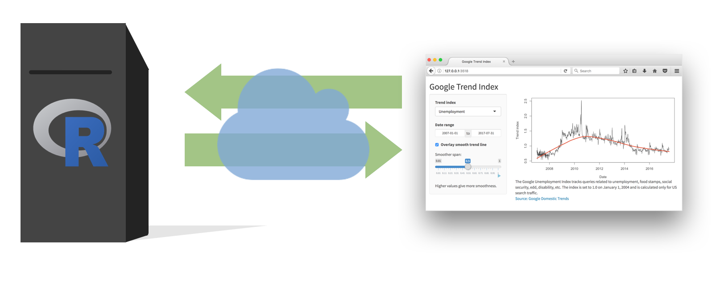
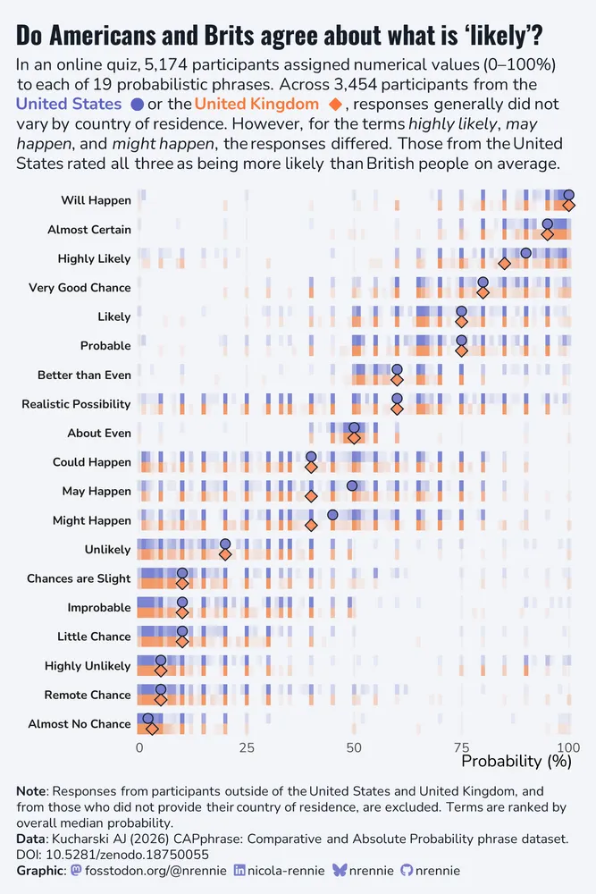

# Warm up

## Announcements {.smaller}

- HW 4 due today at 5 pm

- Next assignment: Mini project 2
  - Mini project 1 scores and feedback to be released later today
  - Mini project 2 will an "improvement" exercise, details to be posted later today as well

- Look out for Canvas announcement requesting Project 2 team names

## Setup {.smaller}

```{r}
#| label: setup
#| message: false
# load packages
library(tidyverse)
library(ggtext)
library(glue)

# set theme for ggplot2
ggplot2::theme_set(ggplot2::theme_minimal(base_size = 16))

# set figure parameters for knitr
knitr::opts_chunk$set(
  fig.width = 7, # 7" width
  fig.asp = 0.618, # the golden ratio
  fig.retina = 3, # dpi multiplier for displaying HTML output on retina
  fig.align = "center", # center align figures
  dpi = 300 # higher dpi, sharper image
)
```

# Shiny: High level view

## Shiny {.center}

Every Shiny app has a webpage that the user visits, <br> and behind this webpage there is a computer that serves this webpage by running R.

```{r echo = FALSE, out.width = "80%"}
knitr::include_graphics("images/high-level-1.png")
```

## Shiny {.center}

When running your app locally, the computer serving your app is your computer.

```{r echo = FALSE, out.width = "100%"}
knitr::include_graphics("images/high-level-2.png")
```

## Shiny {.center}

When your app is deployed, the computer serving your app is a web server.

```{r echo = FALSE, out.width = "100%"}

```

## Shiny {.center}

```{r echo = FALSE, out.width = "100%"}
knitr::include_graphics("images/high-level-4.png")
```

# Anatomy of a Shiny app

## What's in an app?

::: columns
::: {.column width="50%"}

```{r eval = FALSE}
library(shiny)
ui <- fluidPage()


server <- function(
  input,
  output,
  session
) {
  ...
}


shinyApp(
  ui = ui,
  server = server
)
```

:::

::: {.column width="50%"}
-   **User interface** controls the layout and appearance of app

-   **Server function** contains instructions needed to build app
:::
:::

## Data: How likely is 'likely'?

Source: Online quiz by Adam Kucharski via [TidyTuesday](https://github.com/rfordatascience/tidytuesday/blob/main/data/2026/2026-03-10/readme.md)

> In an online quiz, created as an independent project by Adam Kucharski, over 5,000 participants compared pairs of probability phrases (e.g. “Which conveys a higher probability: Likely or Probable?”) and assigned numerical values (0–100%) to each of 19 phrases. The resulting data can be used to analyse how people interpret common probability phrases.

## Inspiration

{width=35% fig-align="center"}

::: aside
Source: [Nicola Rennie's TidyTuesday submission](https://bsky.app/profile/nrennie.bsky.social/post/3mgrh6qjnnb2w).
:::

## Data: `absolute_judgements` {.smaller}

```{r}
#| message: false
absolute_judgements <- read_csv("data/absolute-judgements.csv")
absolute_judgements
```

## Data: `relative_judgements` {.smaller}

```{r}
#| message: false
respondent_metadata <- read_csv("data/respondent-metadata.csv")
respondent_metadata |>
  relocate(country_of_residence, .after = response_id)
```

## Starting plot

```{r}
#| label: starting-plot
#| echo: false
#| fig-width: 10
# Define colors ---------------------------------------------------------------

bg_col <- "#FAFAFA"
highlight_col <- "#7f93b3"
comparison_col <- "#FA9161"

# Select comparison country ---------------------------------------------------

comparison_country <- "United Kingdom"
countries <- c("United States", comparison_country)

# Wrangle data ----------------------------------------------------------------

term_ranks <- absolute_judgements |>
  left_join(respondent_metadata, by = "response_id") |>
  group_by(term) |>
  summarize(med_prob = median(probability)) |>
  arrange(desc(med_prob))

plot_data <- absolute_judgements |>
  mutate(term = factor(term, levels = term_ranks$term)) |>
  left_join(respondent_metadata, by = "response_id") |>
  filter(country_of_residence %in% countries) |>
  drop_na(country_of_residence) |>
  mutate(y = if_else(country_of_residence == "United States", 0.5, -0.5))

summary_data <- plot_data |>
  group_by(country_of_residence, term) |>
  summarize(med_prob = median(probability), .groups = "drop") |>
  mutate(y = if_else(country_of_residence == "United States", 0.5, -0.5))

# Subtitle and caption --------------------------------------------------------

subtitle_text <- glue(
  "In an online quiz, participants assigned numerical values (0-100%) to each of 19 probabilistic phrases.<br>",
  "The plot below compares the distribution of responses from the <b style='color:{highlight_col}'>United States</b> and <b style='color:{comparison_col}'>{comparison_country}</b>, by country of residence."
)

caption_text <- glue(
  "**Note:** Responses from participants outside of the United States and {comparison_country}, and from those who did not provide their country of residence, are excluded.<br>",
  "Terms are ranked by overall median probability.<br><br>",
  "**Source:** Kucharski AJ (2026) CAPphrase: Comparative and Absolute Probability phrase dataset. DOI: 10.5281/zenodo.18750055."
)

# Plot ------------------------------------------------------------------------

ggplot() +
  geom_point(
    data = plot_data,
    mapping = aes(
      x = probability,
      y = y,
      color = country_of_residence
    ),
    alpha = 0.1,
    shape = "square",
    size = 2
  ) +
  geom_point(
    data = summary_data,
    mapping = aes(
      x = med_prob,
      y = y,
      fill = country_of_residence,
      shape = country_of_residence
    ),
    size = 2,
    alpha = 1
  ) +
  facet_wrap(~term, ncol = 1, strip.position = "left") +
  scale_color_manual(
    values = c(
      "United States" = highlight_col,
      "United Kingdom" = comparison_col
    )
  ) +
  scale_fill_manual(
    values = c(
      "United States" = highlight_col,
      "United Kingdom" = comparison_col
    )
  ) +
  scale_shape_manual(
    values = c(
      "United States" = "circle filled",
      "United Kingdom" = "diamond filled"
    )
  ) +
  scale_x_continuous(expand = expansion(0, 0)) +
  scale_y_continuous(limits = c(-0.75, 0.75)) +
  labs(
    title = 'Do Americans agree with others about what is "likely"?',
    subtitle = subtitle_text,
    caption = caption_text,
    x = "Probability (%)",
    y = NULL,
    color = NULL,
    fill = NULL,
    shape = NULL,
  ) +
  coord_cartesian(clip = "off") +
  theme_minimal() +
  theme(
    legend.position = "none",
    plot.title = element_text(face = "bold"),
    plot.title.position = "plot",
    plot.subtitle = element_markdown(
      lineheight = 1.2,
      margin = margin(0, 0, 20, 0)
    ),
    plot.caption = element_markdown(hjust = 0),
    plot.caption.position = "plot",
    plot.margin = margin(5, 15, 5, 5, "pt"),
    plot.background = element_rect(fill = bg_col),
    panel.background = element_rect(fill = bg_col, colour = bg_col),
    strip.text.y.left = element_text(
      face = "bold",
      angle = 0,
      hjust = 1
    ),
    axis.text.y = element_blank(),
    axis.title.x = element_text(hjust = 1),
    panel.grid.major.y = element_blank(),
    panel.grid.minor.y = element_blank(),
    panel.grid.minor = element_blank(),
  )
```

## Data prep {.smaller}

```{r}
#| ref-label: starting-plot
#| output: false
#| code-line-numbers: "12-30"
```

## Geoms + facets {.smaller}

```{r}
#| ref-label: starting-plot
#| output: false
#| code-line-numbers: "|48-58|59-69|70"
```

## Styling plot text with ggtext {.smaller}

```{r}
#| ref-label: starting-plot
#| output: false
#| code-line-numbers: "|1-5|32-43|93-94|107-111"
```

## Ultimate goal

::: {.medium .center-align}
[minecr-likely.share.connect.posit.cloud](https://minecr-likely.share.connect.posit.cloud/)
:::

```{r}
#| echo: false
knitr::include_app(
  "https://minecr-likely.share.connect.posit.cloud/",
  height = "550px"
)
```

# Interactive reporting with Shiny

## Livecoding

::: task
Go to the `ae-13` project and code along in `app-1.R`.
:::

<br>

Highlights:

-   Data pre-processing
-   Basic reactivity

## Livecoding

::: task
Go to the `ae-13` project and code along in `app-2.R`.
:::

<br>

Highlights:

-   Data pre-processing outside of the app
-   Dynamic UI generation
-   Tabsets

# Interactive visualizations with Shiny

## Livecoding

::: task
Go to the `ae-13` project and code along in `app-3.R`.
:::

<br>

Highlights:

-   Linked brushing

# Reference

## Reference

The code for the app can be found [here](https://github.com/vizdata-s26/likely).

```{r}
#| file: https://raw.githubusercontent.com/vizdata-s26/likely/refs/heads/main/app.R
#| eval: false
```
