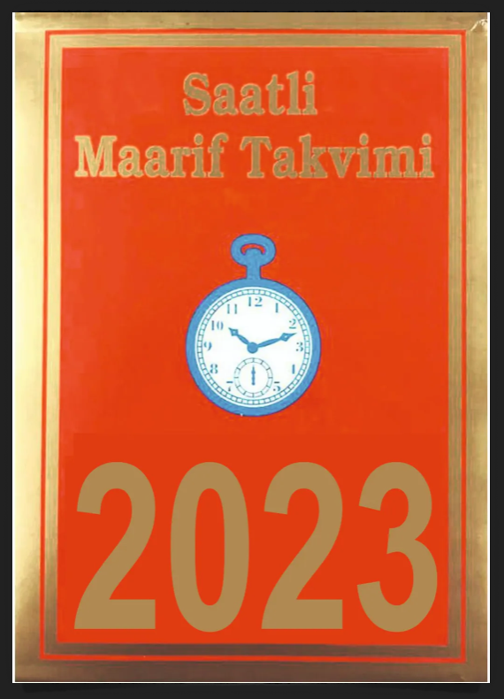
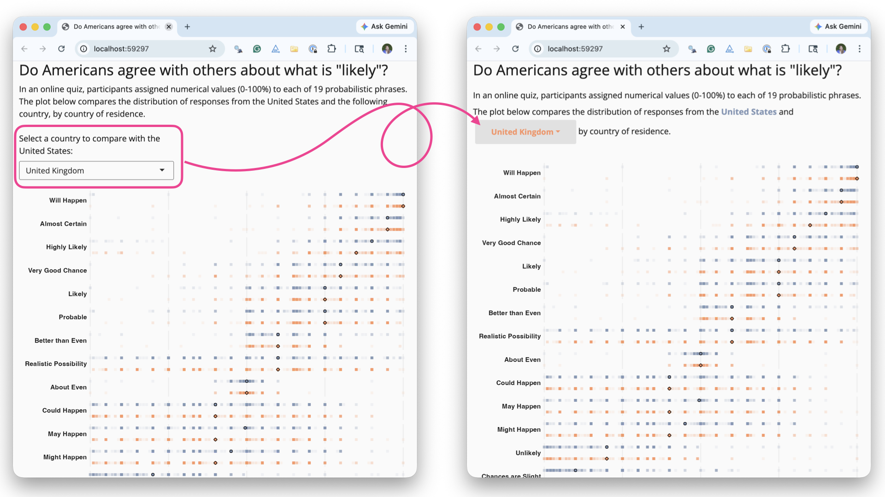
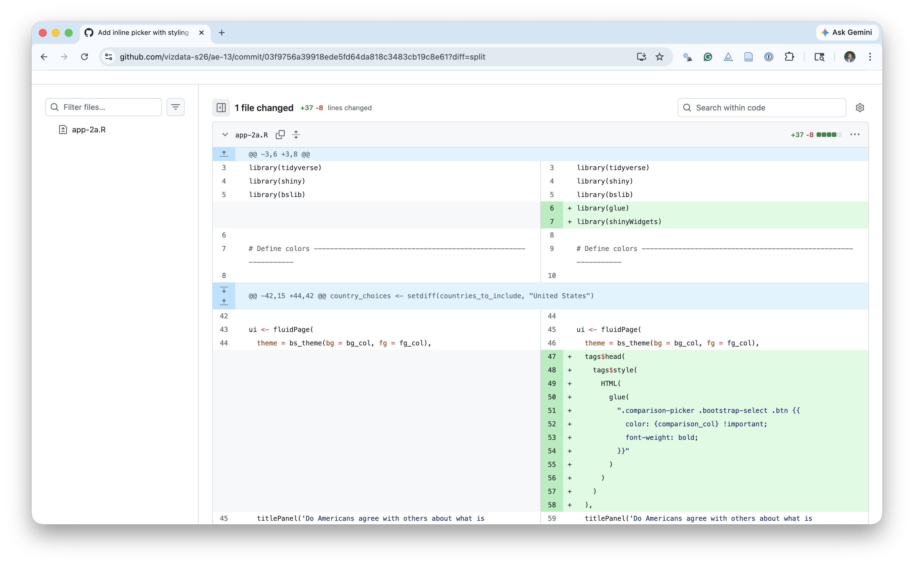
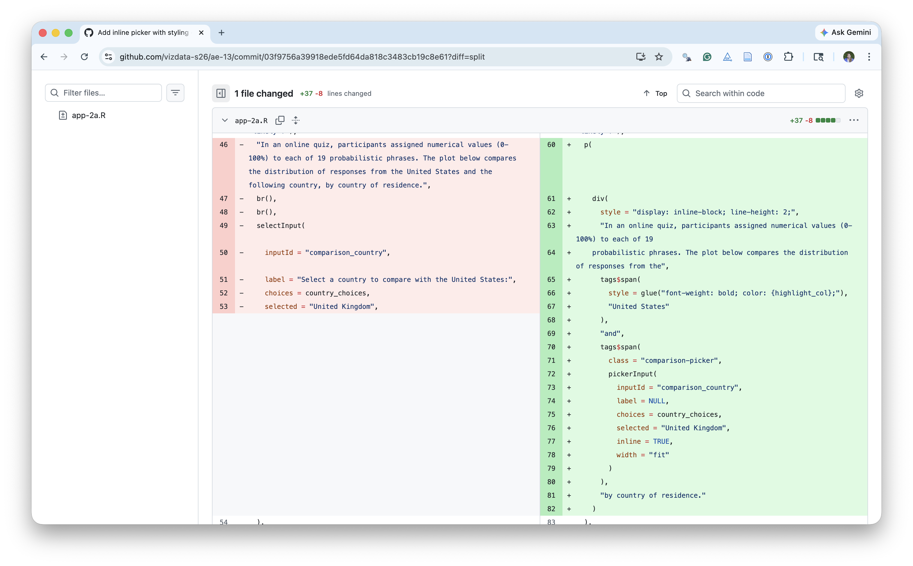
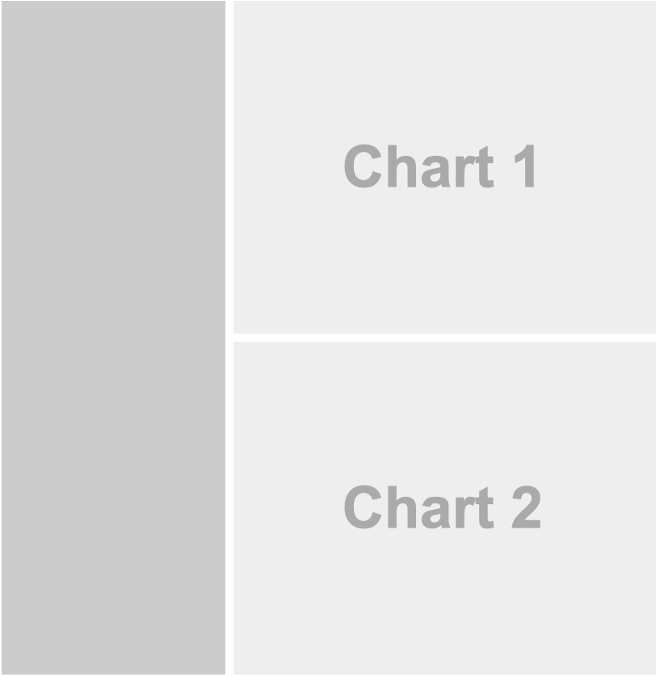
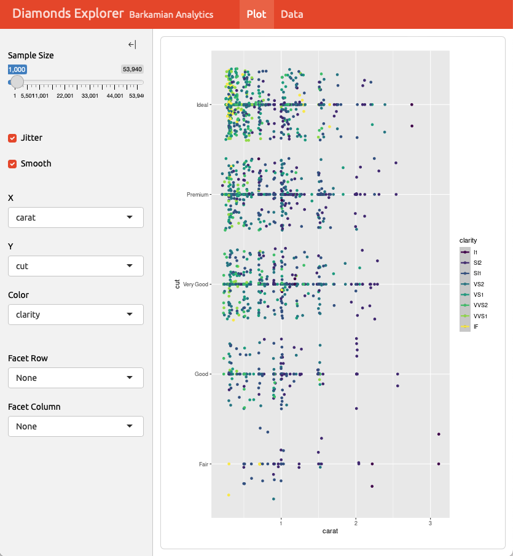
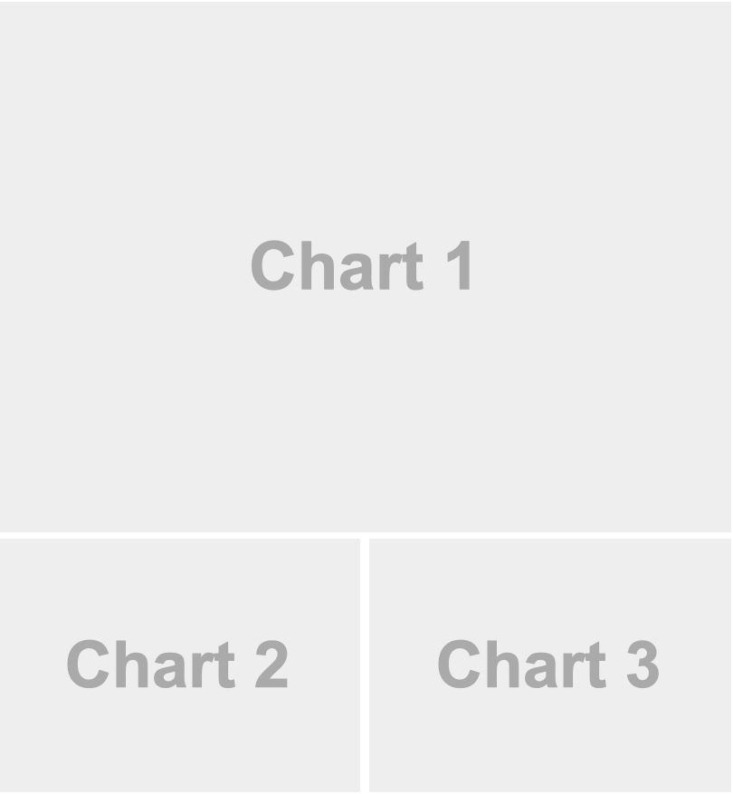
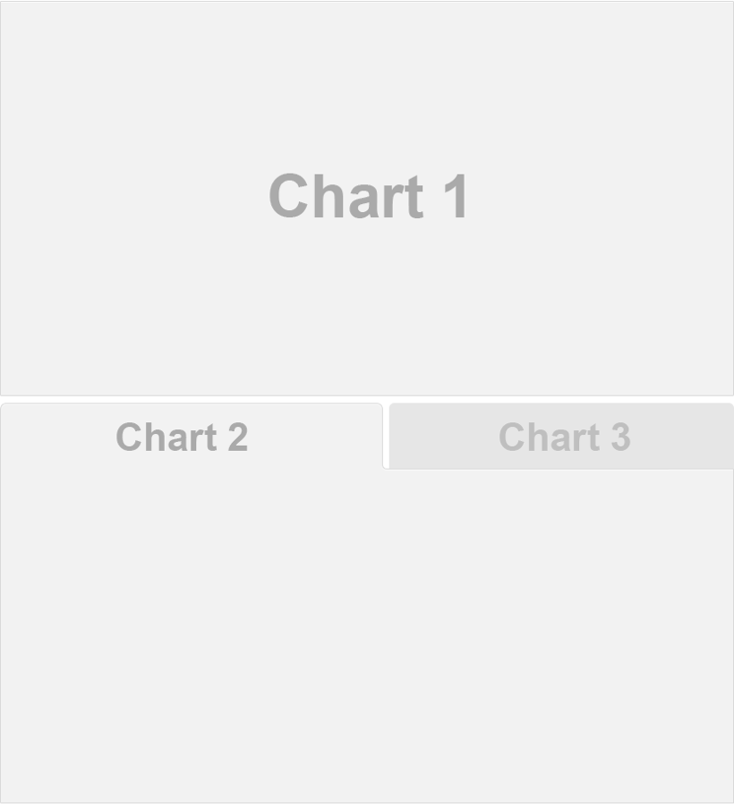
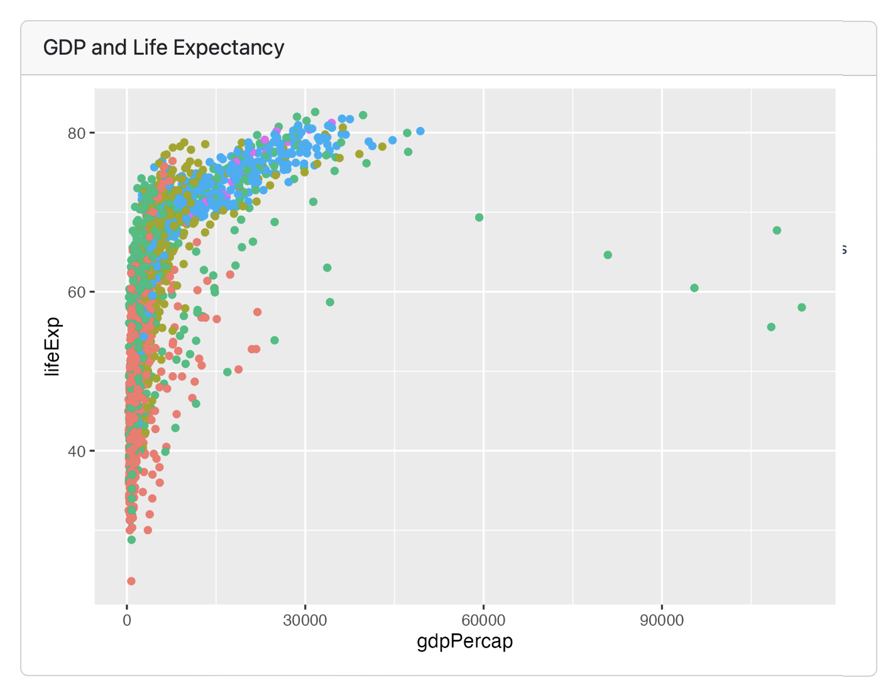
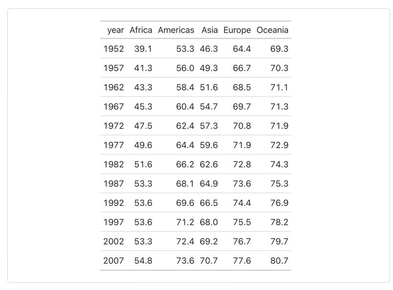

# Warm up

## Announcements {.smaller}

- Mini-project 2 posted, due Monday, April 6 at 5 pm

- Project 2 proposals in lab tomorrow

- If we're missing your team name at <https://github.com/vizdata-s26/teams/blob/main/project-2-teams.csv> please email Leah ASAP, otherwise I'll pick a team name for you!

- Missing responses from 10 students for Project 2 presentations, please fill out the survey on Canvas ASAP. You got an email from me if you're on that list!

## Setup {.smaller}

```{r}
#| label: setup
#| message: false
# load packages
library(tidyverse)
library(ggtext)
library(glue)

# set theme for ggplot2
ggplot2::theme_set(ggplot2::theme_minimal(base_size = 16))

# set figure parameters for knitr
knitr::opts_chunk$set(
  fig.width = 7, # 7" width
  fig.asp = 0.618, # the golden ratio
  fig.retina = 3, # dpi multiplier for displaying HTML output on retina
  fig.align = "center", # center align figures
  dpi = 300 # higher dpi, sharper image
)
```

# Project 2

## Project 2 - potential directions {.smaller .scrollable}

- Present and visualize a technical topic in statistics or mathematics, e.g., Gradient descent, quadrature, autoregressive (AR) models, etc.
- Build a Shiny app that that has an Instagram-like user interface for applying filters, except not filters but themes for ggplots.
- Create an R package that provides functionality for a set of ggplot2 themes and/or color palettes.1
- Build a generative art system.
- Do a deep dive into accessibility for data visualization and build a lesson plan for creating accessible visualizations with ggplot2, Quarto, and generally within the R ecosystem.
- Create an interactive and/or animated spatio-temporal visualization on a topic of interest to you, e.g., redistricting, vaccination, voter suppression, etc.
- Recreate art pieces with ggplot2.
- Make a data visualization telling a story and convert it to an illustration, presenting both the computational and artistic piece side by side.
- Build a dashboard with Quarto and R or Python.
- Create a package that makes it easy to create data visualizations in a particular style.
- Build a website that teaches a data visualization topic of your choice, along with code examples and assessment items.
- Visualize a (non-TidyTuesday) dataset of interest to you (similar to your first project).

## Project 2 - all the details

<br>

::: center-align

<https://vizdata.org/project/project-2.html>

:::

<br>

::: callout-tip

Brainstorm a bunch of ideas and discard them until you settle on a topic that everyone in the team is happy with and feels like a good choice for showcasing what you’ve learned in the class and how you can use that to learn something new and implement for your project.

:::

## Project 2 - inspiration

{fig-align="center"}


# From last time...

## Where we left off

{fig-align="center"}

## What changed I

{fig-align="center"}

## What changed II

{fig-align="center"}

## Livecoding

::: task
Go to the `ae-13` project and **pull**. Then, code along in `app-2a.R`.
:::

<br>

Highlights:

-   Data pre-processing outside of the app
-   Dynamic UI generation
-   Tabsets

## Livecoding

::: task
Go to the `ae-13` project and code along in `app-3.R`.
:::

<br>

Highlights:

-   Linked brushing

## Reference

The code for the app can be found [here](https://github.com/vizdata-s26/likely).

```{r}
#| file: https://raw.githubusercontent.com/vizdata-s26/likely/refs/heads/main/app.R
#| eval: false
```

# Quarto dashboards

A new output format for easily creating\
dashboards from `.qmd` files

##  {.no-line background-image="images/dashboards/dashing-through-snow.png" background-size="contain"}

##  {.no-line background-image="images/dashboards/customer-churn.png" background-size="contain"}

##  {.no-line background-image="images/dashboards/mynorfolk.png" background-size="contain"}

##  {.no-line background-image="images/dashboards/earthquakes.png" background-size="contain"}

##  {.no-line background-image="images/dashboards/model-card.png" background-size="contain"}

##  {.no-line background-image="images/dashboards/shiny-penguins.png" background-size="contain"}

##  {.no-line background-image="images/dashboards/gapminder.png" background-size="contain"}

## .qmd ➝ Dashboard

``` {.markdown code-line-numbers="|3"}
---
title: "Possibly Maybe"
format: dashboard
---

# content goes here...
```

## Dashboard Components

::: incremental
1.  **Navigation Bar and Pages** --- Icon, title, and author along with links to sub-pages (if more than one page is defined).

2.  **Sidebars, Rows & Columns, and Tabsets** --- Rows and columns using markdown heading (with optional attributes to control height, width, etc.).
    Sidebars for interactive inputs.
    Tabsets to further divide content.

3.  **Cards (Plots, Tables, Value Boxes, Content)** --- Cards are containers for cell outputs and free form markdown text.
    The content of cards typically maps to *cells* in your notebook or source document.
:::

## Navigation Bar and Pages


::: {style="margin-top: 0.7em;"}
``` markdown
--- 
title: "Palmer Penguins"
author: "Cobblepot Analytics"
format: 
  dashboard:
    logo: images/penguins.png
    nav-buttons: [linkedin, twitter, github]
---

# Bills

# Flippers

# Data
```
:::

## Sidebars: Page Level

:::: columns
::: column
```` {.markdown style="margin-top: 45px;"}
---
title: "Sidebar"
format: dashboard
---
    
# Page 1

## {.sidebar}

```{{r}}
```

## Column 

```{{r}}
```

```{{r}}
```
````
:::

::: {.column .fragment}

:::
::::

## Sidebars: Global

::: columns
::: column
```` {.markdown style="margin-top: 45px;"}
---
title: "Global Sidebar"
format: dashboard
---
    
# {.sidebar}

Sidebar content (e.g. inputs)

# Plot

```{{r}}
```

# Data

```{{r}}
```
````
:::

::: {.column .fragment}
{width="80%"}
:::
:::

## Layout: Rows

::: columns
::: {.column style="margin-top: 65px;"}
```` markdown
---
title: "Focal (Top)"
format: dashboard
---
    
## Row {height=70%}

```{{r}}
```

## Row {height=30%}

```{{r}}
```

```{{r}}
```
````
:::

::: {.column .fragment}
{width="90%"}
:::
:::

##  {.no-line background-image="images/dashboards/customer-churn.png" background-size="contain"}

## Layout: Columns

::: columns
::: {.column style="margin-top: 40px;"}
```` markdown
---
title: "Focal (Top)"
format: 
  dashboard:
    orientation: columns
---
    
## Column {width=60%}

```{{r}}
```

## Column {width=40%}

```{{r}}
```

```{{python}}
```
````
:::

::: {.column .fragment}

:::
:::

##  {.no-line background-image="images/dashboards/housing-market.png" background-size="contain"}

## Tabset

::: columns
::: {.column style="margin-top: 45px;"}
```` markdown
---
title: "Palmer Penguins"
format: dashboard
---
    
## Row

```{{r}}
```

## Row {.tabset}

```{{r}}
#| title: Chart 2
```

```{{r}}
#| title: Chart 3
```
````
:::

::: {.column .fragment}
{width="87%"}
:::
:::

##  {.no-line background-image="images/dashboards/mynorfolk.png" background-size="contain"}

## Plots

Each code chunk makes a card, and can take a title

::: columns
::: {.column .fragment .smaller}
```` r
```{{r}}
#| title: GDP and Life Expectancy
library(gapminder)
library(tidyverse)
ggplot(gapminder, aes(x = gdpPercap, y = lifeExp, color = continent)) +
  geom_point()
```
````
:::

::: {.column .fragment}
{width="85%"}
:::
:::

## Tables

Each code chunk makes a card, doesn't have to have a title

::: columns
::: {.column .fragment .smaller}
```` r
```{{r}}
library(gapminder)
library(tidyverse)
library(gt)
gapminder |>
  group_by(continent, year) |>
  summarize(mean_lifeExp = round(mean(lifeExp), 1)) |>
  pivot_wider(names_from = continent, values_from = mean_lifeExp) |>
  gt()
```
````
:::

::: {.column .fragment}
{width="85%"}
:::
:::

## Other features

-   Text content

-   Value boxes

-   Expanding cards

## Dashboard deployment

Dashboards are typically just static HTML pages so can be deployed to any web server or web host!

## Interactive Dashboards

<https://quarto.org/docs/dashboards/interactivity/shiny-r>

-   For interactive exploration, some dashboards can benefit from a live R backend

-   To do this with Quarto Dashboards, add interactive [Shiny](https://shiny.posit.co) components

-   Deploy with or without a server!
