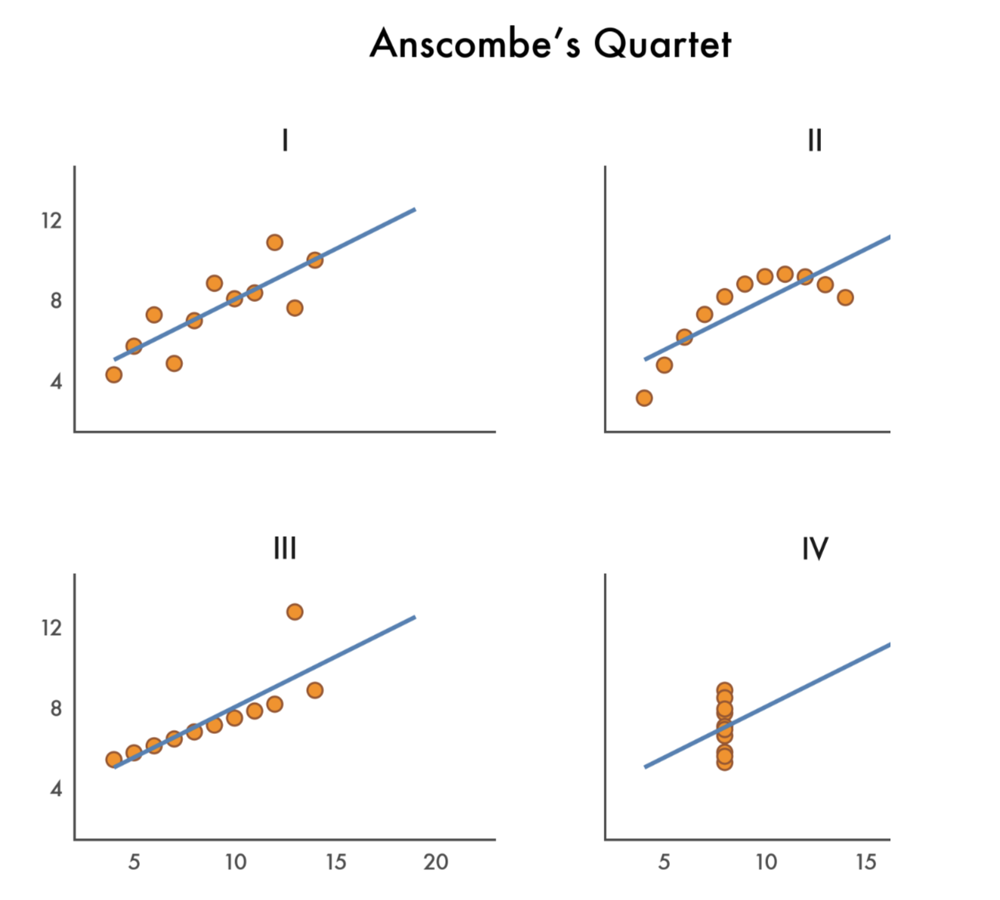

# Warm up

## Announcements {.smaller}

- Project 2 peer evaluation 1 due **today** at 5 pm -- no extensions as we'd like to share summaries before lab tomorrow, those who haven't yet submitted it received a reminder at 11 am

- HW 5 posted, due Monday, April 20 at 5 pm
    - A bit on data prep
    - A bit on Shiny
    - A bit on Python
    - At a minimum, read it over before tomorrow's lab

- Next week:
    - Monday: In memory of [Bill Cleveland](https://en.wikipedia.org/wiki/William_S._Cleveland) -- read the Graphical Perception paper by Cleveland and McGill (1984)
    - Wednesday: Your choice! Animation? Visual inference? A primer on dataviz with AI prior to guest speaker following week? 3D pie charts?! You tell me!

## Setup {.smaller}

- R:

```{r}
#| label: load-packages-r
#| message: false
library(tidyverse)
```

- Python:

```{python}
#| label: load-packages-python
#| eval: false
import polars as pl
from plotnine import *
```

# From last time

## Key differences from ggplot2 {.smaller}

| ggplot2 (R) | plotnine (Python) |
|-------------|-------------------|
| `aes(x = var)` | `aes(x="var")` (quoted strings) |
| `+` at end of line | `+` at start of line (inside parens) |
| `theme(legend.position = ...)` | `theme(legend_position=...)` (underscores) |
| No parens needed | Wrap in `()` for multi-line plots |
| `ggsave()` | `.save()` method on plot object |

. . .

<br/>

```{python}
#| eval: false
# Saving a plot
p = ggplot(...) + geom_point()
p.save("my_plot.png", width=10, height=6, dpi=300)
```

## Back to `ae-16`

::: task
Go to `ae-16` and  work on `ae-16-R-and-Python.qmd`.
:::

# Anscombe's Quartet

## What is Anscombe's Quartet?

- Four datasets created by statistician Francis Anscombe in 1973
- Each dataset has 11 observations with x and y variables
- Designed to illustrate the importance of **visualizing data** before analyzing it

## The data {.smaller}

```{r}
#| label: anscombe-wide
#| include: false
anscombe_wide <- anscombe
```

```{r}
#| label: anscombe-wide-display
anscombe_wide
```

## Longer data {.smaller}

```{r}
#| label: anscombe-summary
anscombe <- anscombe_wide |>
  pivot_longer(
    cols = everything(),
    names_to = c(".value", "set"),
    names_pattern = "(.)(.)"
  )

anscombe
```

## Summary statistics {.smaller}

```{r}
anscombe |>
  group_by(set) |>
  summarize(
    mean_x = mean(x),
    mean_y = mean(y),
    sd_x = sd(x),
    sd_y = sd(y),
    cor_xy = cor(x, y)
  )
```

## The statistics are (nearly) identical!

- Mean of x: 9 (exactly)
- Mean of y: 7.50 (to 2 decimal places)
- Standard deviation of x: 3.32
- Standard deviation of y: 2.03
- Correlation: 0.816
- Linear regression line: y = 3 + 0.5x

. . .

**But are the datasets the same?**

## Let's visualize! {.smaller}

```{r}
#| label: anscombe-plot
#| fig-width: 10
#| fig-height: 7
#| fig-align: center
#| output-location: slide
#| message: false
ggplot(anscombe, aes(x = x, y = y)) +
  geom_point(size = 3) +
  geom_smooth(method = "lm", se = FALSE, color = "steelblue") +
  facet_wrap(
    ~set, 
    labeller = labeller(set = c("1" = "Dataset I", "2" = "Dataset II", "3" = "Dataset III", "4" = "Dataset IV"))
  ) +
  theme_minimal(base_size = 16) +
  labs(
    title = "Anscombe's Quartet",
    subtitle = "Four datasets with nearly identical summary statistics"
  )
```

## What do we see?

- **Dataset I**: Linear relationship (what we might expect)
- **Dataset II**: Non-linear (quadratic) relationship
- **Dataset III**: Perfect linear relationship with one outlier
- **Dataset IV**: No relationship, but one extreme point creates correlation

. . .

<br>

::: {.callout-important}
## The lesson
**Always visualize your data!** Summary statistics alone can be misleading.
:::

## `ae-17` {.smaller}

::: task
Visualize Anscombe's Quartet in Python using `plotnine`! 
Try to get it to be as close to the plot below as possible.
:::

{fig-align="center"}
