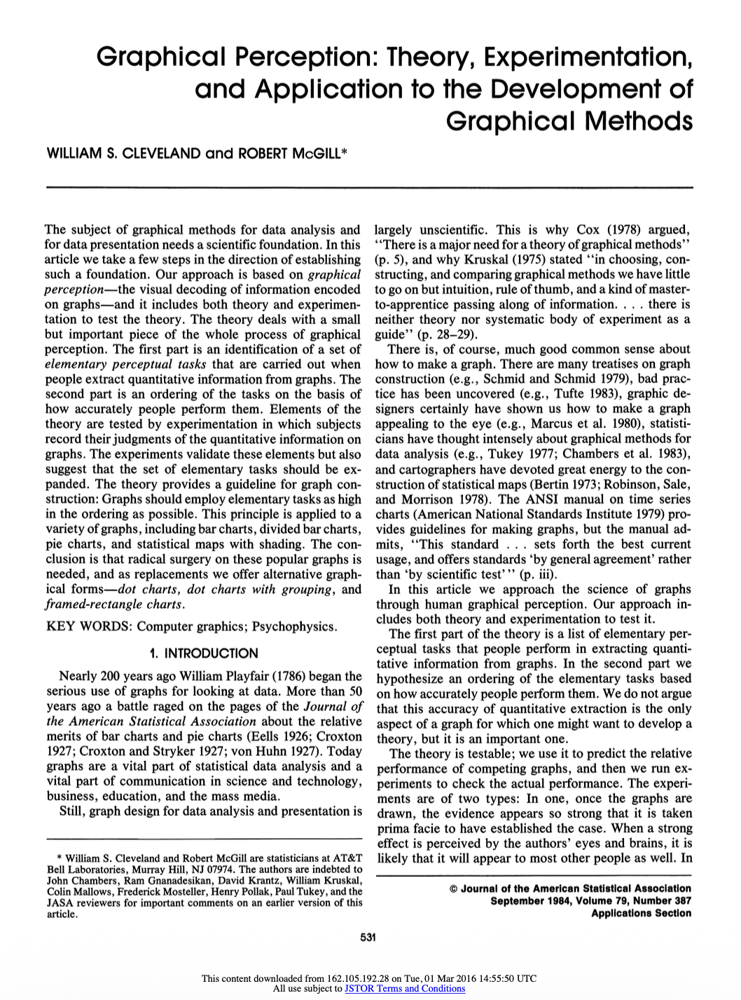
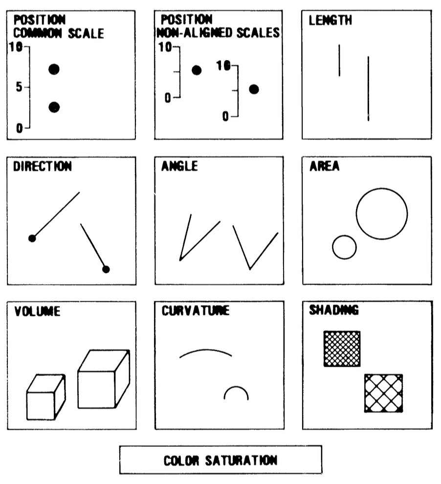
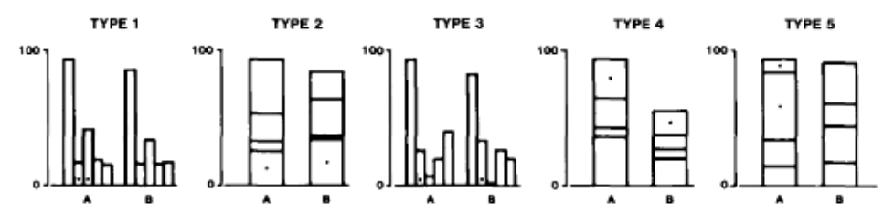
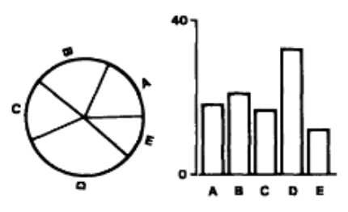
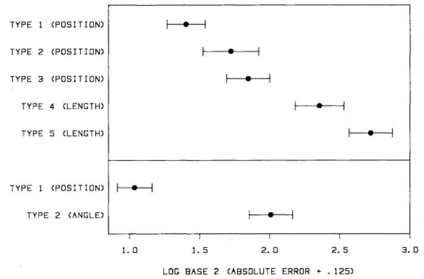
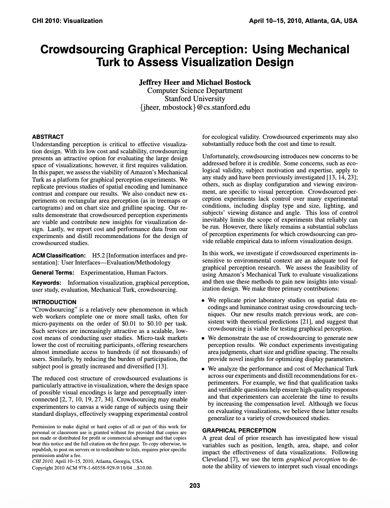

# Warm up

## Setup {.smaller}

```{r}
#| label: setup
#| message: false
# load packages
library(tidyverse)

# set theme for ggplot2
ggplot2::theme_set(ggplot2::theme_minimal(base_size = 16))

# set figure parameters for knitr
knitr::opts_chunk$set(
  fig.width = 7, # 7" width
  fig.asp = 0.618, # the golden ratio
  fig.retina = 3, # dpi multiplier for displaying HTML output on retina
  fig.align = "center", # center align figures
  dpi = 300 # higher dpi, sharper image
)
```

# A foundational paper

## Cleveland & McGill (1984) {.smaller}

::: columns
::: {.column width="60%"}
**"Graphical Perception: Theory, Experimentation, and Application to the Development of Graphical Methods"**

*Journal of the American Statistical Association*

- William S. Cleveland and Robert McGill (AT&T Bell Labs)
- One of the most influential papers in data visualization
- Established empirical foundations for graph design
- Over 2,800 citations
:::

::: {.column width="40%"}
{width="300"}
:::
:::

## The central question

> What makes some graphs easier to read than others?

. . .

Cleveland & McGill's approach:

1. Identify **elementary perceptual tasks** used when reading graphs
2. Rank these tasks by **accuracy** of human judgment
3. **Test** the ranking experimentally
4. **Apply** findings to redesign common graph types

## What is graphical perception?

**Graphical perception** is the visual decoding of information encoded on graphs, i.e., the mental-visual tasks we perform to extract quantitative information:

- Judging positions along a scale
- Comparing lengths
- Estimating angles
- Perceiving areas
- Distinguishing colors/shades

# Elementary perceptual tasks

## 10 Elementary perceptual tasks {.smaller}

Cleveland & McGill identified 10 basic visual tasks people use to extract quantitative information from graphs:

{fig-align="center"}

## The accuracy hierarchy {.smaller}

Cleveland & McGill hypothesized a ranking from **most accurate** to **least accurate**:

| Rank | Elementary Perceptual Task |
|------|---------------------------|
| 1 | Position along a common scale |
| 2 | Position along non-aligned scales |
| 3 | Length, direction, angle |
| 4 | Area |
| 5 | Volume, curvature |
| 6 | Shading, color saturation |

. . .

::: callout-important
**Design principle:** Use elementary perceptual tasks as high in the hierarchy as possible.
:::

## Why this ordering? {.smaller}

The ordering is based on:

- **Psychophysical theories:**

  - Stevens' Power Law
  - Weber's Law

- **Prior experimental research** on magnitude estimation

## Stevens' Power Law
   
Perceived magnitude $p$ relates to actual magnitude $a$ by: 
   
$$p = k \cdot a^\alpha$$
   
- For **length**: $\alpha \approx 1$ (accurate)

- For **area**: $\alpha < 1$ (underestimate)

- For **volume**: $\alpha << 1$ (severely underestimate)

## Get ready to answer some questions!

<https://app.wooclap.com/STA313S26>

{fig-align="center"}

## Question 1 {.smaller}

::: task

Which of the following is true?

a. Plot A has more points than Plot B
b. Plot B has more points than Plot A
c. Plot A and Plot B have the same number of points

:::

```{r}
#| label: question-1
#| echo: false
#| layout-ncol: 2
set.seed(123)

n1 <- 10
x <- runif(n1, 1, 100)
y <- 0.5 * x + rnorm(n1, mean = 0, sd = 20)
df <- tibble(x = x, y = y)
ggplot(df, aes(x = x, y = y)) +
  geom_point(size = 3) +
  labs(title = "Plot A")

n2 <- 20
x <- runif(n2, 1, 100)
y <- 0.5 * x + rnorm(n2, mean = 0, sd = 20)
df <- tibble(x = x, y = y)
ggplot(df, aes(x = x, y = y)) +
  geom_point(size = 3) +
  labs(title = "Plot B")
```



## Question 2 {.smaller}

::: task

Which of the following is true?

a. Plot A has more points than Plot B
b. Plot B has more points than Plot A
c. Plot A and Plot B have the same number of points

:::

```{r}
#| label: question-2
#| echo: false
#| layout-ncol: 2
set.seed(456)

n3 <- 120
x <- runif(n3, 1, 100)
y <- 0.5 * x + rnorm(n3, mean = 0, sd = 200)
df <- tibble(x = x, y = y)
ggplot(df, aes(x = x, y = y)) +
  geom_point(size = 3) +
  labs(title = "Plot A")

n4 <- 110
x <- runif(n4, 1, 100)
y <- 0.5 * x + rnorm(n4, mean = 0, sd = 200)
df <- tibble(x = x, y = y)
ggplot(df, aes(x = x, y = y)) +
  geom_point(size = 3) +
  labs(title = "Plot B")
```



## Question 1

```{r}
#| ref-label: question-1
#| fig-show: hide
```

## Question 2

```{r}
#| ref-label: question-2
#| fig-show: hide
```

## Weber's Law

Just noticeable difference is proportional to the magnitude of the initial stimulus.

> The minimum increase of stimulus which will produce a perceptible increase of sensation is proportional to the pre-existent stimulus.

::: aside

Source: [Weber-Fechner law](https://en.wikipedia.org/wiki/Weber%E2%80%93Fechner_law)

:::


## Common graphs and their tasks 

| Graph Type | Primary Perceptual Task |
|------------|------------------------|
| Bar chart (simple) | Position on common scale |
| Grouped bar chart | Position on common scale |
| Stacked bar chart | Length (for non-baseline segments) |
| Pie chart | Angle |
| Bubble chart | Area |
| Choropleth map | Shading/color |
| Treemap | Area |

## Example: Bar chart vs. Pie chart

::: columns
::: {.column width="50%"}
**Bar chart**

- Primary task: Position along common scale
- High accuracy
- Easy to compare values

```{r}
#| echo: false
#| fig-height: 4
df <- tibble(
  category = LETTERS[1:5],
  value = c(25, 20, 18, 22, 15)
)

ggplot(df, aes(x = category, y = value)) +
  geom_col(fill = "steelblue") +
  labs(title = "Bar Chart")
```

:::

::: {.column width="50%"}
**Pie chart**

- Primary task: Angle judgment
- Lower accuracy
- Harder to compare non-adjacent slices

```{r}
#| echo: false
#| fig-height: 4
ggplot(df, aes(x = "", y = value, fill = category)) +
  geom_col(width = 1) +
  coord_polar(theta = "y") +
  theme_void() +
  labs(title = "Pie Chart") +
  scale_fill_brewer(palette = "Set2")
```

:::
:::

# The experiments

## Experimental design {.smaller}

Cleveland & McGill ran two main experiments.

- Experiment 1: Position-length judgments using bar charts

- Experiment 2: Position-angle judgments comparing bar charts and pie charts

## Experiment 1: Position-length

- 55 subjects judged divided bar charts
- 5 types of bar chart configurations
- Tasks: 
  - Which of the two indicated (with a dot) bars or two segments is smaller?
  - What percentage is the smaller of the larger?

{fig-align="center"}

## Experiment 2: Position-angle

- 54 subjects judged pie charts vs. bar charts
- 10 sets of values, each shown as pie and bar
- Tasks: 
  - Which bar or segment is largest?
  - What percentage each of the other four values is of the largest bar or segment?

{fig-align="center"}

## Measuring accuracy

They used **log absolute error**:

$$
\text{Error} = \log_2\left(|\text{judged percent} - \text{true percent}| + \frac{1}{8}\right)
$$

. . .

Why log scale?

- Measures **relative** error (a 5% error on 10% is worse than 5% error on 80%)
- The $\frac{1}{8}$ prevents $\log(0)$ issues
- Robust to outliers

## Experiment results {.smaller}

::: columns

::: {.column width="80%"}

{fig-align="center"}

:::

::: {.column width="20%"}

**Position-length:** Average errors for length judgments are considerably larger than those for position judgments.

**Position-angle:** Average errors for angle judgments is considerably larger than for position judgments.

:::

:::

# Activity

## Task

For each chart shown, identify the **smaller** of two marked values (A or B), then estimate **what percentage the smaller is of the larger**.

- Make a quick visual judgment
- Do NOT measure or calculate
- Record your answer

## Activity instructions {.smaller}

1. You will see **6 charts** - 2 of each type:
   - Bar charts (position judgment)
   - Pie charts (angle judgment)
   - Bubble charts (area judgment)

2. For each chart:
   - Identify which value (A or B) is smaller
   - Estimate: "The smaller is ___% of the larger"

3. Record answers on the provided sheet

## Practice: Bar chart

```{r}
#| echo: false
#| fig-height: 5
practice_bar <- tibble(
  label = c("A", "B", "", "", ""),
  category = c("X", "Y", "W", "V", "Z"),
  value = c(35, 70, 50, 45, 60)
)

ggplot(practice_bar, aes(x = category, y = value)) +
  geom_col(fill = "steelblue", width = 0.7) +
  geom_text(aes(label = label), vjust = -0.5, size = 8, fontface = "bold") +
  labs(title = "Practice: Bar Chart", y = "Value", x = NULL) +
  ylim(0, 100)
```

**Which is smaller? What % is it of the larger?**

## Practice answer

A = 35, B = 70

A is smaller.

**True percentage:** 35/70 = **50%**

How close was your estimate?

## Trial 1: Bar chart

```{r}
#| echo: false
#| fig-height: 5
set.seed(123)
trial1 <- tibble(
  label = c("A", "", "B", "", ""),
  category = c("P", "Q", "R", "S", "T"),
  value = c(42, 65, 78, 30, 55)
)

ggplot(trial1, aes(x = category, y = value)) +
  geom_col(fill = "steelblue", width = 0.7) +
  geom_text(aes(label = label), vjust = -0.5, size = 8, fontface = "bold") +
  labs(title = "Trial 1: Bar Chart", y = "Value", x = NULL) +
  ylim(0, 100)
```

**Record:** Smaller = ___ | Estimate = ____%

## Trial 2: Bar chart

```{r}
#| echo: false
#| fig-height: 5
trial2 <- tibble(
  label = c("", "A", "", "B", ""),
  category = c("P", "Q", "R", "S", "T"),
  value = c(45, 28, 70, 85, 50)
)

ggplot(trial2, aes(x = category, y = value)) +
  geom_col(fill = "steelblue", width = 0.7) +
  geom_text(aes(label = label), vjust = -0.5, size = 8, fontface = "bold") +
  labs(title = "Trial 2: Bar Chart", y = "Value", x = NULL) +
  ylim(0, 100)
```

**Record:** Smaller = ___ | Estimate = ____%

## Trial 3: Pie chart

```{r}
#| echo: false
#| fig-height: 5
trial3_pie <- tibble(
  label = c("A", "", "B", "", ""),
  category = c("1", "2", "3", "4", "5"),
  value = c(18, 25, 30, 15, 12)
)

ggplot(trial3_pie, aes(x = "", y = value, fill = category)) +
  geom_col(width = 1, color = "white") +
  coord_polar(theta = "y") +
  geom_text(aes(label = label),
            position = position_stack(vjust = 0.5),
            size = 8, fontface = "bold", color = "white") +
  theme_void() +
  labs(title = "Trial 3: Pie Chart") +
  scale_fill_brewer(palette = "Set2") +
  theme(legend.position = "none")
```

**Record:** Smaller = ___ | Estimate = ____%

## Trial 4: Pie chart

```{r}
#| echo: false
#| fig-height: 5
trial4_pie <- tibble(
  label = c("", "A", "", "B", ""),
  category = c("1", "2", "3", "4", "5"),
  value = c(20, 12, 28, 25, 15)
)

ggplot(trial4_pie, aes(x = "", y = value, fill = category)) +
  geom_col(width = 1, color = "white") +
  coord_polar(theta = "y") +
  geom_text(aes(label = label),
            position = position_stack(vjust = 0.5),
            size = 8, fontface = "bold", color = "white") +
  theme_void() +
  labs(title = "Trial 4: Pie Chart") +
  scale_fill_brewer(palette = "Set2") +
  theme(legend.position = "none")
```

**Record:** Smaller = ___ | Estimate = ____%

## Trial 5: Bubble chart

```{r}
#| echo: false
#| fig-height: 5
trial5_bubble <- tibble(
  x = c(2, 5, 3, 6, 4),
  y = c(3, 4, 5, 2, 4),
  size = c(sqrt(35), sqrt(20), sqrt(50), sqrt(28), sqrt(42)),
  label = c("A", "", "", "B", "")
)

ggplot(trial5_bubble, aes(x = x, y = y, size = size)) +
  geom_point(color = "steelblue", alpha = 0.7) +
  geom_text(aes(label = label), size = 8, fontface = "bold", vjust = -1.5) +
  scale_size_identity() +
  theme_minimal() +
  labs(title = "Trial 5: Bubble Chart") +
  theme(
    axis.text = element_blank(),
    axis.title = element_blank(),
    panel.grid = element_blank()
  ) +
  coord_fixed(xlim = c(0, 8), ylim = c(0, 7))
```

**Record:** Smaller = ___ | Estimate = ____%

## Trial 6: Bubble chart

```{r}
#| echo: false
#| fig-height: 5
trial6_bubble <- tibble(
  x = c(2, 5, 3, 6, 4),
  y = c(3, 4, 5, 2, 4),
  size = c(sqrt(40), sqrt(65), sqrt(25), sqrt(55), sqrt(45)),
  label = c("", "A", "B", "", "")
)

ggplot(trial6_bubble, aes(x = x, y = y, size = size)) +
  geom_point(color = "steelblue", alpha = 0.7) +
  geom_text(aes(label = label), size = 8, fontface = "bold", vjust = -1.5) +
  scale_size_identity() +
  theme_minimal() +
  labs(title = "Trial 6: Bubble Chart") +
  theme(
    axis.text = element_blank(),
    axis.title = element_blank(),
    panel.grid = element_blank()
  ) +
  coord_fixed(xlim = c(0, 8), ylim = c(0, 7))
```

**Record:** Smaller = ___ | Estimate = ____%

## Answer key {.smaller}

| Trial | Chart Type | True Values | Smaller | True % |
|-------|-----------|-------------|---------|--------|
| 1 | Bar | A=42, B=78 | A | 53.8% |
| 2 | Bar | A=28, B=85 | A | 32.9% |
| 3 | Pie | A=18, B=30 | A | 60.0% |
| 4 | Pie | A=12, B=25 | A | 48.0% |
| 5 | Bubble | A=35, B=28 | B | 80.0% |
| 6 | Bubble | A=65, B=25 | B | 38.5% |

## Calculate your error

For each trial, calculate:

$$\text{Error} = |\text{Your estimate} - \text{True percent}|$$

Then, add your results to <https://duke.is/sta313-apr13>, so we can calculate average by chart type:

- **Bar chart error** = (Error 1 + Error 2) / 2
- **Pie chart error** = (Error 3 + Error 4) / 2
- **Bubble chart error** = (Error 5 + Error 6) / 2

## Class results {.smaller}

::: task
Let's collect and visualize our class results.

- What was your average error for each chart type?
- Did the class results follow the Cleveland & McGill hierarchy?
:::

**Expected pattern:**

Bar chart error < Pie chart error < Bubble chart error

(Position < Angle < Area)

## Discussion questions

1. Which chart type gave you the most trouble? Why?

2. Were there any trials where you felt confident but were actually far off?

3. How might these findings change how you design visualizations?

4. When might you still choose a "less accurate" encoding?

# Heer & Bostock (2010)

## Crowdsourcing graphical perception {.smaller}

::: columns
::: {.column width="60%"}
**26 years later...**

Jeffrey Heer and Michael Bostock (Stanford) replicated Cleveland & McGill using Amazon Mechanical Turk.

**Why replicate?**

- Test if crowdsourcing is viable for perception experiments
- Extend to new chart types (treemaps, bubble charts)
- Larger, more diverse subject pool
:::

::: {.column width="40%"}
{width="300"}
:::
:::

## Experiment 1A: Replicating Cleveland & McGill

**Method:**

- 7 judgment types (5 from original + 2 new)
- N=50 subjects per chart
- Same proportional judgment task
- 70 total trials (HITs)

**New additions:**

- Type 6: Angle (pie chart)
- Type 7: Circular area (bubble chart)

## Replication results {.smaller}

::: columns
::: {.column width="50%"}
**Cleveland & McGill (1984)**

- Lab setting
- ~50 subjects
- Paper-based

Results showed clear ranking: T1 < T2 < T3 < T4 < T5
:::

::: {.column width="50%"}
**Heer & Bostock (2010)**

- Crowdsourced (MTurk)
- ~50 subjects per condition
- Web-based

**Same ranking preserved!**

Crowdsourcing validated as viable method.
:::
:::

## New insights from Heer & Bostock {.smaller}

**Experiment 1B: Rectangular area judgments**

- Tested treemaps and rectangle comparisons
- Found aspect ratio affects accuracy
- Squares (1:1 ratio) are **not** optimal
- Rectangles with extreme ratios performed worst

. . .

**Experiment 3: Chart size and gridlines**

- Tested chart heights: 40, 80, 160, 320 pixels
- Tested gridline spacing: 10, 20, 50, 100 units
- **Findings:**
  - Charts under 80 pixels have significantly more error
  - Gridlines help, but too dense (10 units) impedes reading

## Extended hierarchy

Based on combined evidence, the updated ranking:

| Rank | Perceptual Task | Chart Examples |
|------|----------------|----------------|
| 1 | Position (common scale) | Bar chart, dot plot |
| 2 | Position (non-aligned) | Small multiples |
| 3 | Length | Stacked bar (non-baseline) |
| 4 | Angle | Pie chart |
| 5 | Circular area | Bubble chart |
| 6 | Rectangular area | Treemap |

# Implications for design

## Redesigning common graphs

Cleveland & McGill suggested replacements:

| Instead of... | Use... |
|--------------|--------|
| Pie chart | Dot chart or bar chart |
| Divided bar chart | Grouped dot chart |
| Stacked area chart | Multiple line charts |
| Choropleth map | Framed rectangle chart |

## Dot (lollipop) chart: A Cleveland favorite

```{r}
#| echo: false
#| fig-height: 5
df <- tibble(
  category = c("A", "B", "C", "D", "E"),
  value = c(23, 17, 12, 28, 20)
)

ggplot(df, aes(x = value, y = fct_reorder(category, value))) +
  geom_segment(aes(x = 0, xend = value, yend = category), color = "gray70") +
  geom_point(size = 4) +
  labs(
    x = "Value",
    y = NULL,
    title = "Dot Chart"
  ) +
  theme(panel.grid.major.y = element_blank())
```

## Limitations to keep in mind {.smaller}

The hierarchy applies to **extracting precise quantitative values**, but:

- **Part-to-whole relationships**: Pie charts can show "roughly half" well
- **Patterns and trends**: Position isn't always the goal
- **Memorability**: Some "worse" encodings may be more memorable
- **Engagement**: Aesthetic appeal matters for communication

. . .

::: callout-note
The "best" chart depends on the **task** and **audience**. Cleveland & McGill's hierarchy is a guide, not a rule.
:::

## Further reading {.smaller}

**Original papers:**

- Cleveland, W. S., & McGill, R. (1984). Graphical perception: Theory, experimentation, and application to the development of graphical methods. *Journal of the American Statistical Association*, 79(387), 531-554.

- Heer, J., & Bostock, M. (2010). Crowdsourcing graphical perception: Using Mechanical Turk to assess visualization design. *CHI 2010*.

**Related:**

- Cleveland, W. S. (1993). *Visualizing Data*. Hobart Press.
- Munzner, T. (2014). *Visualization Analysis and Design*. CRC Press, Ch. 5.
