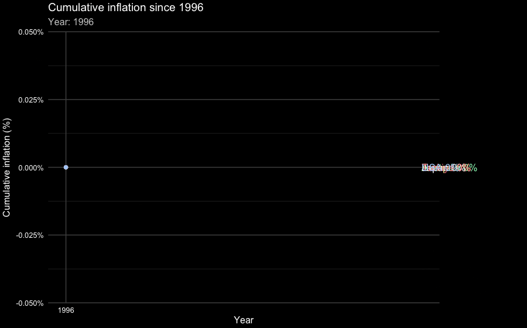
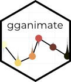
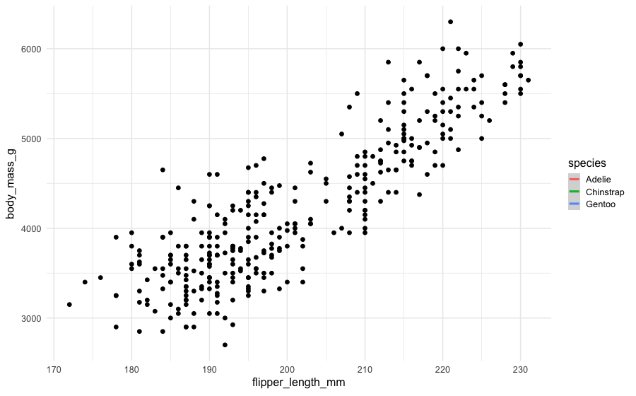
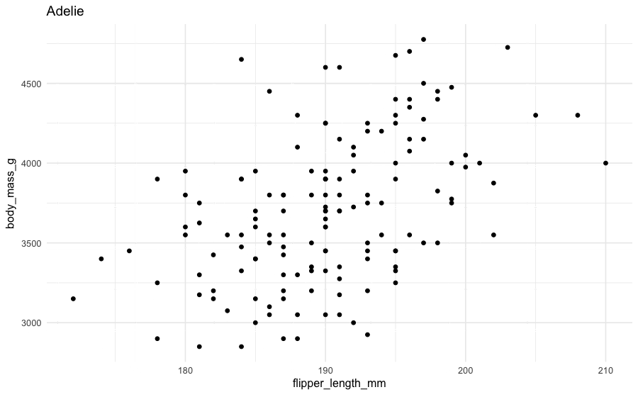
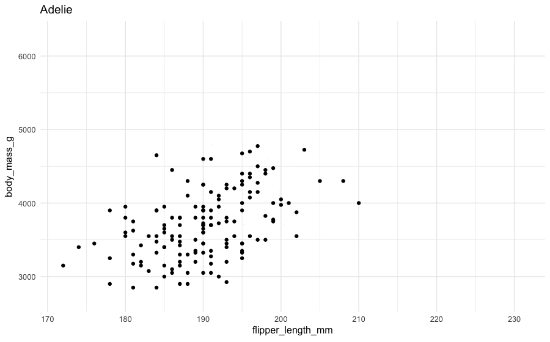
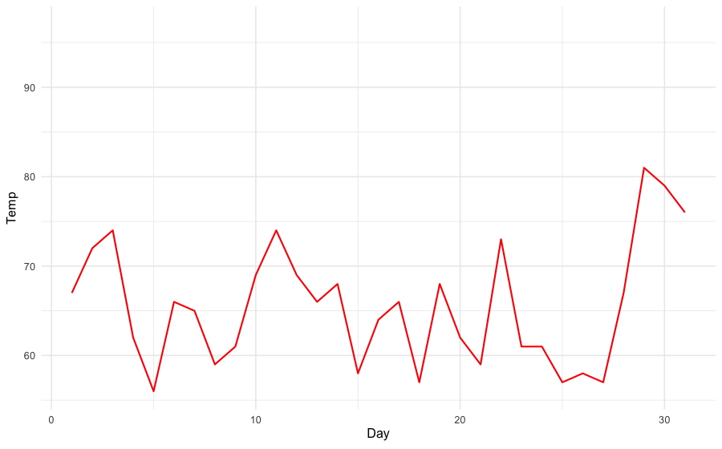
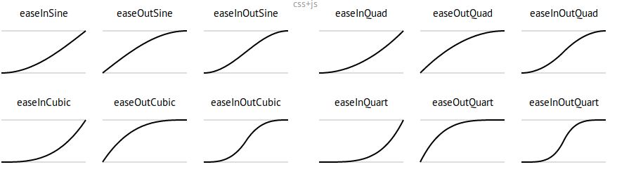
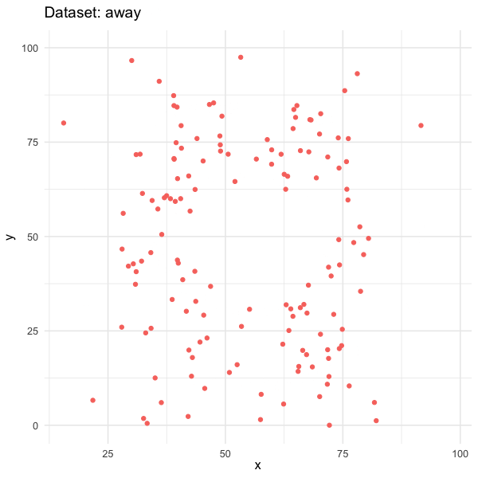

# Warm up

## Announcements {.smaller}

- Lab tomorrow: Project code review -- you must be there to earn the points for it

- My remaining office hours:
  - Thursday (tomorrow) 9-10 am -- No OH on Friday
  - Monday 9-10 am
  - Wednesday 12-1 pm
  - Or by apppointment

- Monday's class: Guest lecturer Hadley Wickham
  - Read: [A personal history of the tidyverse](https://hadley.github.io/25-tidyverse-history/)
  - (Optional) Peruse Hadley's PhD thesis [Practical tools for exploring data and models](http://had.co.nz/thesis/practical-tools-hadley-wickham.pdf)
  - Submit: [At least one question for Hadley](https://app.wooclap.com/events/STA313S26/live-session) by noon on Monday and (optionally) upvote another student's question -- 3 extra points on your lowest, non-dropped, HW assignment

## Setup {.smaller}

```{r}
#| label: setup
#| message: false
# load packages
library(tidyverse)
library(gganimate)
library(gifski)
library(scales)
library(gt)
library(palmerpenguins)
library(datasauRus)

# set theme for ggplot2
ggplot2::theme_set(ggplot2::theme_minimal(base_size = 16))

# set figure parameters for knitr
knitr::opts_chunk$set(
  fig.width = 7, # 7" width
  fig.asp = 0.618, # the golden ratio
  fig.retina = 3, # dpi multiplier for displaying HTML output on retina
  fig.align = "center", # center align figures
  dpi = 300 # higher dpi, sharper image
)
```

# Animation

## Insta-piration

```{=html}
<iframe src="https://www.instagram.com/reel/DWg7Fa9DqA8/embed" width="400" height="650" frameborder="0" scrolling="no" +allowtransparency="true"></iframe>
```

## Re-construction



## Philosophy

-   The purpose of interactivity is to display more than can be achieved with persistent plot elements, and to invite the reader to engage with the plot.

-   Animation allows more information to be displayed, but developer keeps control

-   Beware that it is easy to forget what was just displayed, so keeping some elements persistent, maybe faint, can be useful for the reader

## **gganimate**

::: columns

::: {.column width="60%"}
-   **gganimate** extends the grammar of graphics as implemented by ggplot2 to include the description of animation

-   It provides a range of new grammar classes that can be added to the plot object in order to customize how it should change with time
:::

::: {.column width="40%"}
{fig-align="center" width="250"}
:::

:::

## How does gganimate work?

-   Start with a ggplot2 specification

-   Add layers with graphical primitives (geoms)

-   Add formatting specification

-   Add animation specification

# Data

## Data source {.smaller}

Consumer Price Index (CPI) data from [FRED](https://fred.stlouisfed.org/) (Federal Reserve Economic Data):

| Country | Series ID | Description |
|---------|-----------|-------------|
| USA | [CPIAUCSL](https://fred.stlouisfed.org/series/CPIAUCSL) | CPI for All Urban Consumers: All Items |
| Turkiye | [TURCPIALLMINMEI](https://fred.stlouisfed.org/series/TURCPIALLMINMEI) | CPI: All Items for Turkey |
| Australia | [AUSCPIALLQINMEI](https://fred.stlouisfed.org/series/AUSCPIALLQINMEI) | CPI: All Items for Australia |
| Europe | [CP0000EZ19M086NEST](https://fred.stlouisfed.org/series/CP0000EZ19M086NEST) | HICP: All Items for Euro Area |
| Japan | [FPCPITOTLZGJPN](https://fred.stlouisfed.org/series/FPCPITOTLZGJPN) | Inflation, consumer prices (annual %) |

All series use **annual averages** with data from 1996-2024.

## Methodology {.smaller}

**Goal:** Calculate cumulative percentage change in prices since 1996, rebased to 0% at inception.

- For countries with CPI index levels (USA, Turkiye, Australia, Europe):

$$\text{Cumulative Inflation}_t = \left( \frac{\text{CPI}_t}{\text{CPI}_{1996}} - 1 \right) \times 100$$

- For Japan (only annual inflation rates available):

  1. Construct index starting at 100 in 1996
  2. Compound forward: $\text{Index}_t = \text{Index}_{t-1} \times (1 + r_t / 100)$
  3. Calculate cumulative change: $\text{Cumulative}_t = \text{Index}_t - 100$

## Construct the data - download {.smaller}

- USA: [CPIAUCSL](https://fred.stlouisfed.org/graph/fredgraph.csv?id=CPIAUCSL&cosd=1996-01-01&coed=2024-12-31&fq=Annual&fam=avg)
- Turkiye: [TURCPIALLMINMEI](https://fred.stlouisfed.org/graph/fredgraph.csv?id=TURCPIALLMINMEI&cosd=1996-01-01&coed=2024-12-31&fq=Annual&fam=avg)
- Australia: [AUSCPIALLQINMEI](https://fred.stlouisfed.org/graph/fredgraph.csv?id=AUSCPIALLQINMEI&cosd=1996-01-01&coed=2024-12-31&fq=Annual&fam=avg)
- Europe: [CP0000EZ19M086NEST](https://fred.stlouisfed.org/graph/fredgraph.csv?id=CP0000EZ19M086NEST&cosd=1996-01-01&coed=2024-12-31&fq=Annual&fam=avg)
- Japan -- Only annual inflation rates available: [FPCPITOTLZGJPN](https://fred.stlouisfed.org/graph/fredgraph.csv?id=FPCPITOTLZGJPN&cosd=1996-01-01&coed=2024-12-31&fq=Annual&fam=avg)

## Load the data {.smaller}

```{r}
#| message: false
usa <- read_csv(here::here("slides/25", "data/data-raw/CPIAUCSL.csv"))
turkiye <- read_csv(here::here(
  "slides/25",
  "data/data-raw/TURCPIALLMINMEI.csv"
))
australia <- read_csv(here::here(
  "slides/25",
  "data/data-raw/AUSCPIALLQINMEI.csv"
))
europe <- read_csv(here::here(
  "slides/25",
  "data/data-raw/CP0000EZ19M086NEST.csv"
))
japan <- read_csv(here::here("slides/25", "data/data-raw/FPCPITOTLZGJPN.csv"))
```

## Cumulative inflation calculation I

US:

```{r}
usa_inflation <- usa |>
  mutate(
    year = year(mdy(observation_date)),
    cumulative_pct = (CPIAUCSL / CPIAUCSL[1] - 1) * 100
  ) |>
  select(year, USA = cumulative_pct)

usa_inflation
```

## Cumulative inflation calculation II {.smaller}

Turkiye, Australia, and Europe:

```{r}
turkiye_inflation <- turkiye |>
  mutate(
    year = year(mdy(observation_date)),
    cumulative_pct = (TURCPIALLMINMEI / TURCPIALLMINMEI[1] - 1) * 100
  ) |>
  select(year, Turkiye = cumulative_pct)

australia_inflation <- australia |>
  mutate(
    year = year(mdy(observation_date)),
    cumulative_pct = (AUSCPIALLQINMEI / AUSCPIALLQINMEI[1] - 1) * 100
  ) |>
  select(year, Australia = cumulative_pct)

europe_inflation <- europe |>
  mutate(
    year = year(mdy(observation_date)),
    cumulative_pct = (CP0000EZ19M086NEST / CP0000EZ19M086NEST[1] - 1) * 100
  ) |>
  select(year, Europe = cumulative_pct)
```

## Cumulative inflation III {.smaller}

Japan:

```{r}
japan_inflation <- japan |>
  mutate(
    year = year(mdy(observation_date)),
    index = 100 * cumprod(1 + FPCPITOTLZGJPN / 100),
    cumulative_pct = index - 100,
    cumulative_pct = cumulative_pct - cumulative_pct[1]
  ) |>
  select(year, Japan = cumulative_pct)

japan_inflation
```

## Putting it altogether {.smaller}

```{r}
inflation <- usa_inflation |>
  left_join(turkiye_inflation, by = "year") |>
  left_join(australia_inflation, by = "year") |>
  left_join(europe_inflation, by = "year") |>
  left_join(japan_inflation, by = "year")

inflation
```

```{r}
#| include: false
write_csv(inflation, here::here("slides/25/data/inflation.csv"))
```

## Results summary {.smaller}

```{r}
#| label: inflation-summary
inflation |>
  filter(year == max(year)) |>
  pivot_longer(
    cols = -year,
    names_to = "country",
    values_to = "cumulative_pct"
  ) |>
  arrange(desc(cumulative_pct))
```

. . .

<br>

::: task
What are some key findings about how prices have changed in these countries since 1996?
:::

## Reshape data for plotting {.smaller}

```{r}
#| label: reshape-data
inflation_long <- inflation |>
  pivot_longer(
    cols = -year,
    names_to = "country",
    values_to = "cumulative_pct"
  )

inflation_long
```

## Colors 

```{r}
flag_colors <- c(
  "USA" = "#207ae8", # blue
  "Turkiye" = "#B22234", # red
  "Australia" = "#009C3D", # green
  "Europe" = "#FFCC00", # yellow
  "Japan" = "#000000" # black
)
```

# Building up

## Static plot (excluding Turkiye) {.smaller}

```{r}
#| label: static-plot-exclude-turkiye
inflation_long |>
  filter(country != "Turkiye") |>
  ggplot(aes(x = year, y = cumulative_pct, color = country)) +
  geom_line(linewidth = 1) +
  geom_point(size = 2) +
  scale_color_manual(values = flag_colors) +
  scale_y_continuous(labels = label_comma(suffix = "%")) +
  labs(
    title = "Cumulative inflation since 1996",
    x = "Year",
    y = "Cumulative inflation (%)",
    color = "Country"
  )
```

## Static plot (with Turkiye) {.smaller}

```{r}
#| label: static-plot-include-turkiyezz
inflation_long |>
  ggplot(aes(x = year, y = cumulative_pct, color = country)) +
  geom_line(linewidth = 1) +
  geom_point(size = 2) +
  scale_color_manual(values = flag_colors) +
  scale_y_continuous(labels = label_comma(suffix = "%")) +
  labs(
    title = "Cumulative inflation since 1996",
    x = "Year",
    y = "Cumulative inflation (%)",
    color = "Country"
  )
```

## Animate {.smaller}

```{r}
#| label: animate-1
#| warning: false
#| cache: true
#| code-line-numbers: "|21|16"
#| output-location: column
inflation_long |>
  ggplot(
    aes(
      x = year,
      y = cumulative_pct,
      color = country,
      group = country
    )
  ) +
  geom_line(linewidth = 1) +
  geom_point(size = 2) +
  scale_color_manual(values = flag_colors) +
  scale_y_continuous(labels = label_comma(suffix = "%")) +
  labs(
    title = "Cumulative inflation since 1996",
    subtitle = "Year: {round(frame_along)}",
    x = "Year",
    y = "Cumulative inflation (%)",
    color = "Country"
  ) +
  transition_reveal(year)
```

## Animate with expanding y-axis {.smaller}

```{r}
#| label: animate-2
#| warning: false
#| cache: true
#| code-line-numbers: "|22"
#| output-location: column
inflation_long |>
  ggplot(
    aes(
      x = year,
      y = cumulative_pct,
      color = country,
      group = country
    )
  ) +
  geom_line(linewidth = 1) +
  geom_point(size = 2) +
  scale_color_manual(values = flag_colors) +
  scale_y_continuous(labels = label_comma(suffix = "%")) +
  labs(
    title = "Cumulative inflation since 1996",
    subtitle = "Year: {round(frame_along)}",
    x = "Year",
    y = "Cumulative inflation (%)",
    color = "Country"
  ) +
  transition_reveal(year) +
  view_follow(fixed_x = TRUE)
```

# Grammar of animation

## Grammar of animation

::: incremental
-   Transitions: `transition_*()` defines how the data should be spread out and how it relates to itself across time

-   Views: `view_*()` defines how the positional scales should change along the animation

-   Shadows: `shadow_*()` defines how data from other points in time should be presented in the given point in time

-   Entrances/Exits: `enter_*()`/`exit_*()` defines how new data should appear and how old data should disappear during the course of the animation

-   Easing: `ease_aes()` defines how different aesthetics should be eased during transitions
:::

## Transitions

How the data changes through the animation.

```{r}
#| label: transition-tbl
#| echo: false
tribble(
  ~Function               , ~Description                                                           ,
  "transition_manual"     , "Build an animation frame by frame (no tweening applied)."             ,
  "transition_states"     , "Transition between frames of a plot (like moving between facets)."    ,
  "transition_time"       , "Like transition_states, except animation pacing respects time."       ,
  "transition_components" , "Independent animation of plot elements (by group)."                   ,
  "transition_reveal"     , "Gradually extends the data used to reveal more information."          ,
  "transition_layers"     , "Animate the addition of layers to the plot. Can also remove layers."  ,
  "transition_filter"     , "Transition between a collection of subsets from the data."            ,
  "transition_events"     , "Define entrance and exit times of each visual element (row of data)."
) |>
  gt() |>
  tab_style(
    style = cell_text(font = "monospace"),
    locations = cells_body(
      columns = Function
    )
  ) |>
  tab_style(
    style = cell_text(size = px(24)),
    locations = cells_body(
      columns = everything()
    )
  )
```

## Transitions

::: task
Which transition was used in the following animations?
:::

::: columns
::: {.column width="50%"}

```{r}
#| label: transition-layers
#| warning: false
#| echo: false
#| out-width: "100%"
#| message: false
transition_layers <- penguins |>
  drop_na() |>
  ggplot(aes(x = flipper_length_mm, y = body_mass_g)) +
  geom_point(fill = NA_character_) +
  geom_smooth(color = "grey", se = FALSE, method = 'loess', formula = y ~ x) +
  geom_smooth(aes(color = species)) +
  transition_layers(
    layer_length = 1,
    transition_length = 2,
    from_blank = FALSE,
    keep_layers = c(Inf, 0, 0)
  ) +
  enter_fade() +
  exit_fade()
```

```{r}
#| eval: false
#| echo: false
animate(
  transition_layers,
  fps = 2,
  nframes = 20,
  width = 900,
  height = 560,
  renderer = gifski_renderer()
)
anim_save("slides/25/gifs/transition_layers.gif")
```



:::

::: {.column width="50%"}

::: {.fragment fragment-index="1"}
`transition_layers()`

New layers are being added (and removed) over the dots.
:::

:::

:::

## Views

How the plot window changes through the animation.

```{r}
#| label: views-tbl
#| echo: false
tribble(
  ~Function          , ~Description                                                             ,
  "view_follow"      , "Change the view to follow the range of current data."                   ,
  "view_step"        , "Similar to view_follow, except the view is static between transitions." ,
  "view_step_manual" , "Same as view_step, except view ranges are manually defined."            ,
  "view_zoom"        , "Similar to view_step, but appears smoother by zooming out then in."     ,
  "view_zoom_manual" , "Same as view_zoom, except view ranges are manually defined."
) |>
  gt() |>
  tab_style(
    style = cell_text(font = "monospace"),
    locations = cells_body(
      columns = Function
    )
  ) |>
  tab_style(
    style = cell_text(size = px(24)),
    locations = cells_body(
      columns = everything()
    )
  )
```

## Views

::: task
Which view was used in the following animations?
:::

::: columns
::: {.column width="50%"}

```{r}
#| label: view-follow
#| echo: false
#| gganimate: list(nframes = 20)
#| cache: true
#| out-width: "100%"
view_follow <- penguins |>
  drop_na() |>
  ggplot(aes(x = flipper_length_mm, y = body_mass_g)) +
  geom_point() +
  labs(title = "{closest_state}") +
  transition_states(species, transition_length = 4, state_length = 1) +
  view_follow()
```

```{r}
#| eval: false
#| echo: false
animate(
  view_follow,
  fps = 2,
  nframes = 20,
  width = 900,
  height = 560,
  renderer = gifski_renderer()
)
anim_save("slides/25/gifs/view_follow.gif")
```


:::

::: {.column width="50%"}

::: {.fragment fragment-index="1"}
`view_follow()`

Plot axis follows the range of the data.
:::

:::

:::

## Shadows

How the history of the animation is shown.
Useful to indicate speed of changes.

```{r}
#| label: shadows-tbl
#| echo: false
tribble(
  ~Function      , ~Description                                                          ,
  "shadow_mark"  , "Previous (and/or future) frames leave permananent background marks." ,
  "shadow_trail" , "Similar to shadow_mark, except marks are from tweened data."         ,
  "shadow_wake"  , "Shows a shadow which diminishes in size and/or opacity over time."
) |>
  gt() |>
  tab_style(
    style = cell_text(font = "monospace"),
    locations = cells_body(
      columns = Function
    )
  ) |>
  tab_style(
    style = cell_text(size = px(24)),
    locations = cells_body(
      columns = everything()
    )
  )
```

## Shadows

::: task
Which shadow was used in the following animations?
:::

::: columns

::: {.column width="50%"}

```{r}
#| label: shadow-wake
#| echo: false
#| gganimate: list(nframes = 50)
#| warning: false
#| out-width: "100%"
shadow_wake <- penguins |>
  drop_na() |>
  ggplot(aes(x = flipper_length_mm, y = body_mass_g)) +
  geom_point(size = 2) +
  labs(title = "{closest_state}") +
  transition_states(species, transition_length = 4, state_length = 1) +
  shadow_wake(wake_length = 0.2)
```

```{r}
#| eval: false
#| echo: false
animate(
  shadow_wake,
  fps = 4,
  nframes = 20,
  width = 900,
  height = 560,
  renderer = gifski_renderer()
)
anim_save("slides/25/gifs/shadow_wake.gif")
```



:::

::: {.column width="50%"}

::: {.fragment fragment-index="1"}
`shadow_wake()`

The older tails of the points shrink in size, leaving a "wake" behind it.
:::

:::

:::

## Shadows

::: task
Which shadow was used in the following animations?
:::

::: columns

::: {.column width="50%"}

```{r}
#| label: shadow-mark
#| echo: false
#| gganimate: list(nframes = 20)
#| cache: true
#| out.width: "100%"
shadow_mark <- ggplot(airquality, aes(Day, Temp)) +
  geom_line(color = "red", linewidth = 1) +
  transition_time(Month) +
  shadow_mark(color = "black", linewidth = 0.75)
```

```{r}
#| eval: false
#| echo: false
animate(
  shadow_mark,
  fps = 2,
  nframes = 20,
  width = 900,
  height = 560,
  renderer = gifski_renderer()
)
anim_save("slides/25/gifs/shadow_mark.gif")
```



:::

::: {.column width="50%"}

::: {.fragment fragment-index="1"}

`shadow_mark()`

Permanent marks are left by previous points in the animation.

:::

:::

:::

## Entrances and exits

How elements of the plot appear and disappear.

```{r}
#| label: enter-exit-tbl
#| echo: false
tribble(
  ~Function                     , ~Description                                               ,
  "enter_appear/exit_disappear" , "Poof! Instantly appears or disappears."                   ,
  "enter_fade/exit_fade"        , "Opacity is used to fade in or out the elements."          ,
  "enter_grow/exit_shrink"      , "Element size will grow from or shrink to zero."           ,
  "enter_recolor/exit_recolor"  , "Change element colors to blend into the background."      ,
  "enter_fly/exit_fly"          , "Elements will move from/to a specific x,y position."      ,
  "enter_drift/exit_drift"      , "Elements will shift relative from/to their x,y position." ,
  "enter_reset/exit_reset"      , "Clear all previously added entrace/exits."
) |>
  gt() |>
  tab_style(
    style = cell_text(font = "monospace"),
    locations = cells_body(
      columns = Function
    )
  ) |>
  tab_style(
    style = cell_text(size = px(24)),
    locations = cells_body(
      columns = everything()
    )
  )
```

## Animation controls

How data moves from one position to another.

``` r
p + ease_aes({aesthetic} = {ease})
p + ease_aes(x = "cubic")
```

[](https://easings.net/)

::: aside
Source: https://easings.net/
:::

# Deeper dive

## A not-so-simple example {.smaller}

Pass in the dataset to ggplot

```{r}
#| label: dino-1
#| output-location: column
ggplot(datasaurus_dozen)
```

## A not-so-simple example {.smaller}

For each dataset we have x and y values, in addition we can map dataset to color

```{r}
#| label: dino-2
#| output-location: column
#| code-line-numbers: "3"
ggplot(
  datasaurus_dozen,
  aes(x, y, color = dataset)
)
```

## A not-so-simple example {.smaller}

Trying a simple scatter plot first, but there is too much information

```{r}
#| label: dino-3
#| output-location: column
#| code-line-numbers: "5"
ggplot(
  datasaurus_dozen,
  aes(x, y, color = dataset)
) +
  geom_point(show.legend = FALSE)
```

## A not-so-simple example {.smaller}

We can use facets to split up by dataset, revealing the different distributions

```{r}
#| label: dino-4
#| output-location: column
#| code-line-numbers: "6"
ggplot(
  datasaurus_dozen,
  aes(x, y, color = dataset)
) +
  geom_point(show.legend = FALSE) +
  facet_wrap(~dataset)
```

## A not-so-simple example {.smaller}

We can just as easily turn it into an animation, transitioning between dataset states!

```{r}
#| label: dino-5
#| output-location: column
#| code-line-numbers: "6-13"
#| cache: true
datasaurus_dozen <- ggplot(
  datasaurus_dozen,
  aes(x, y, color = dataset)
) +
  geom_point(size = 2, show.legend = FALSE) +
  transition_states(
    dataset,
    transition_length = 3,
    state_length = 1
  ) +
  labs(
    title = "Dataset: {closest_state}"
  )
```

## A not-so-simple example

```{r}
#| echo: false
#| eval: false
animate(
  datasaurus_dozen,
  fps = 4,
  nframes = 30,
  width = 600,
  height = 600,
  renderer = gifski_renderer()
)
anim_save("slides/25/gifs/datasaurus_dozen.gif")
```



# Tips

## Animation options {.smaller}

Sometimes you need more frames, sometimes fewer

-   Save plot object, and use `animate()` with arguments like
    -   `nframes`: number of frames to render (default 100)
    -   `fps`: framerate of the animation in frames/sec (default 10)
    -   `duration`: length of the animation in seconds (unset by default)
    -   etc.

. . .

-   In Quarto, save the plot and animate it with `animate()`.

. . .

-   Learn more at <https://gganimate.com/reference/animate.html>

## Considerations in making effective animations

-   Pace: speed of animation Quick animations may be hard to follow. Slow animations are boring and tedious.

. . .

-   Perplex: amount of information It is easy for animations to be overwhelming and confusing. Multiple simple animations can be easier to digest.

. . .

-   Purpose: Usefulness of using animation Is animation needed? Does it provide additional value?

## Cumulative inflation, the making of

::: task
Go to `ae-18`.
We'll live-code tasks 1 and 2.
You'll work on Task 3.
:::

## Acknowledgements

-   [Getting your plots to talk back by Di Cook](http://emitanaka.org/datavis-workshop-ssavic/slides/day2-session3.pdf)
-   [gganimate workshop by Mitchell O'Hara-Wild](https://github.com/numbats/gganimate-workshop)
